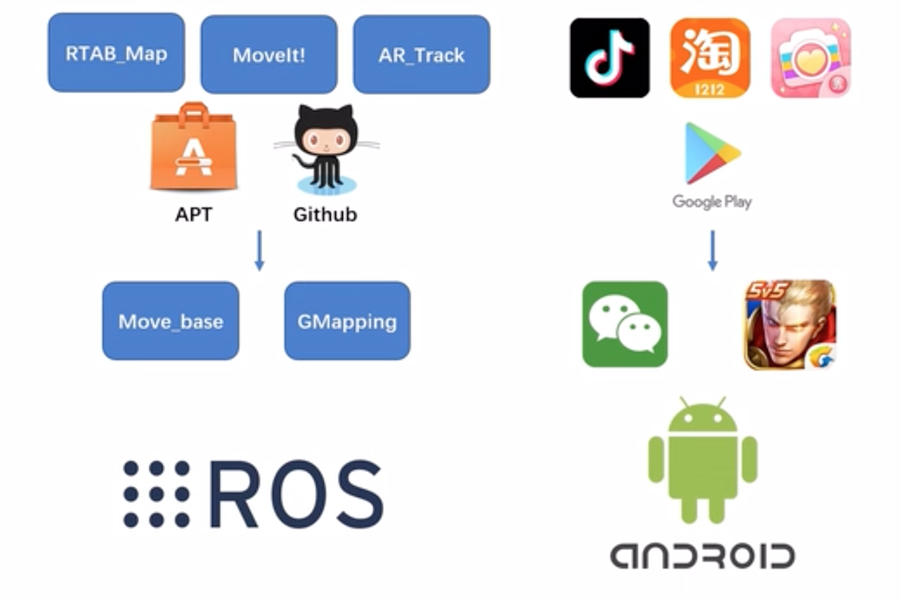
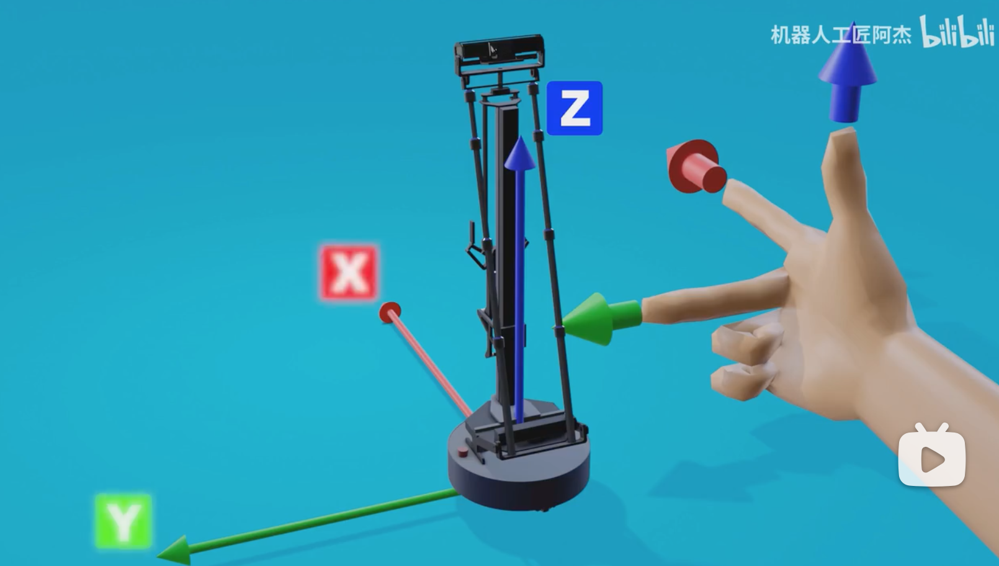
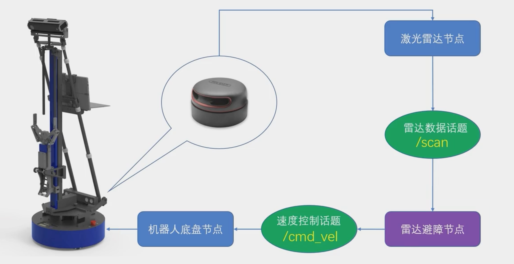

<!--
 * @Author       : Bingqiang Zhou
 * @Date         : 2023-07-09 22:20:38
 * @LastEditors  : Bingqiang Zhou
 * @LastEditTime : 2023-07-23 01:05:11
 * @Description  : 
-->

# ROS快速入门教程-笔记

以下内容为观看bilibili网站视频：[机器人操作系统 ROS 快速入门教程](https://space.bilibili.com/411541289/channel/collectiondetail?sid=693700)时所做的笔记。

- [ROS快速入门教程-笔记](#ros快速入门教程-笔记)
  - [一、ROS是什么](#一ros是什么)
  - [二、零基础，如何学习机器人操作系统ROS](#二零基础如何学习机器人操作系统ros)
    - [2.1、ROS版本选择](#21ros版本选择)
    - [2.2、如何进行实践](#22如何进行实践)
    - [2.3、学习建议](#23学习建议)
  - [三、学习ROS，安装Ubuntu，虚拟机和双系统如何选择](#三学习ros安装ubuntu虚拟机和双系统如何选择)
  - [四、从没接触过Ubuntu，如何上手ROS开发](#四从没接触过ubuntu如何上手ros开发)
  - [五、机器人操作系统ROS的安装心得以及rosdep问题的处理](#五机器人操作系统ros的安装心得以及rosdep问题的处理)
    - [5.1、导入ROS安装步骤](#51导入ros安装步骤)
    - [5.2、导入ROS安装源](#52导入ros安装源)
    - [5.3、下载安装ROS](#53下载安装ros)
    - [5.4、环境参数设置](#54环境参数设置)
    - [5.5、rosdep初始化](#55rosdep初始化)
    - [5.6、运行一些案例](#56运行一些案例)
  - [六、APT源，ROS的软件包应用商店](#六apt源ros的软件包应用商店)
  - [七、在Github上寻找安装ROS软件包](#七在github上寻找安装ros软件包)
  - [八、ROS开发神器VisualStudioCode的安装和设置](#八ros开发神器visualstudiocode的安装和设置)
  - [九、超级终端Terminator ROS开发得力助手](#九超级终端terminator-ros开发得力助手)
  - [十、ROS的基础单元：Node节点和Package包](#十ros的基础单元node节点和package包)
  - [十一、初学ROS，年轻人的第一个Node节点](#十一初学ros年轻人的第一个node节点)
    - [11.1、创建Package软件包](#111创建package软件包)
    - [11.2、构建第一个包的步骤](#112构建第一个包的步骤)
  - [十二、ROS的主要通讯方式：Topic话题与Message消息](#十二ros的主要通讯方式topic话题与message消息)
    - [12.1、定义](#121定义)
    - [12.2、外延补充](#122外延补充)
    - [12.3、Message消息类型](#123message消息类型)
  - [十三、ROS中，使用C++编写Publisher发布者节点](#十三ros中使用c编写publisher发布者节点)
    - [13.1、Publisher发布者的C++实现](#131publisher发布者的c实现)
    - [13.2、常用工具/命令](#132常用工具命令)
  - [十四、ROS中，使用C++编写Subscriber订阅者节点](#十四ros中使用c编写subscriber订阅者节点)
    - [14.1、Subscriber订阅者的C++实现](#141subscriber订阅者的c实现)
    - [14.2、常用工具/命令](#142常用工具命令)
  - [十五、ROS中，使用launch文件一次启动多个节点](#十五ros中使用launch文件一次启动多个节点)
    - [15.1、编写运行launch文件](#151编写运行launch文件)
    - [15.2、launch文件小结](#152launch文件小结)
  - [十六、ROS中，使用Python编写Publisher发布者节点](#十六ros中使用python编写publisher发布者节点)
    - [16.1、与用C++编写的软件包的不同](#161与用c编写的软件包的不同)
    - [16.2、C++与Python编写发布者节点的步骤的不同](#162c与python编写发布者节点的步骤的不同)
    - [16.3、Python编写Publisher发布者节点](#163python编写publisher发布者节点)
  - [十七、ROS中，使用Python编写Subscriber订阅者节点](#十七ros中使用python编写subscriber订阅者节点)
    - [17.1、C++与Python编写订阅者节点的步骤的不同](#171c与python编写订阅者节点的步骤的不同)
    - [17.2、Python编写Subscriber订阅者节点](#172python编写subscriber订阅者节点)
    - [17.3、Python编写的软件包launch文件编写](#173python编写的软件包launch文件编写)
  - [十八、ROS机器人运动控制](#十八ros机器人运动控制)
    - [18.1、矢量运动坐标系](#181矢量运动坐标系)
    - [18.2、旋转运动坐标系](#182旋转运动坐标系)
    - [18.3、速度控制消息包](#183速度控制消息包)
    - [18.4、机器人运动控制流程](#184机器人运动控制流程)
  - [十九、ROS中，用C++实现机器人运动控制](#十九ros中用c实现机器人运动控制)
    - [19.1、使用wpr\_simulation工程进行仿真](#191使用wpr_simulation工程进行仿真)
    - [19.2、机器人运动控制实现思路](#192机器人运动控制实现思路)
  - [二十、在ROS中，使用Python编写运动控制功能](#二十在ros中使用python编写运动控制功能)
    - [20.1、机器人运动控制实现思路](#201机器人运动控制实现思路)
  - [二十一、激光雷达工作原理](#二十一激光雷达工作原理)
    - [21.1、激光雷达相关说明](#211激光雷达相关说明)
    - [21.2、激光雷达工作原理](#212激光雷达工作原理)
  - [二十二、ROS中，使用RViz观测传感器数据](#二十二ros中使用rviz观测传感器数据)
    - [22.1、`RViz`工具的介绍](#221rviz工具的介绍)
    - [22.2、`Gazebo`与`RViz`区别与联系](#222gazebo与rviz区别与联系)
  - [二十三、ROS系统中的激光雷达消息包格式](#二十三ros系统中的激光雷达消息包格式)
  - [二十四、ROS中，用C++实现获取激光雷达数据](#二十四ros中用c实现获取激光雷达数据)
    - [24.1、激光雷达数据获取流程](#241激光雷达数据获取流程)
  - [二十五、ROS中，用Python实现获取激光雷达数据](#二十五ros中用python实现获取激光雷达数据)
  - [二十六、ROS中，用C++实现激光雷达避障](#二十六ros中用c实现激光雷达避障)
  - [二十七、ROS中，用Python实现激光雷达避障](#二十七ros中用python实现激光雷达避障)
  - [二十八、ROS中的IMU惯性测量单元消息包](#二十八ros中的imu惯性测量单元消息包)
  - [二十九、ROS中，使用C++实现IMU数据获取](#二十九ros中使用c实现imu数据获取)
  - [三十、ROS中，使用Python实现IMU数据获取](#三十ros中使用python实现imu数据获取)
  - [三十一、ROS中，用C++实现IMU航向锁定](#三十一ros中用c实现imu航向锁定)
  - [三十二、ROS中，用Python实现IMU航向锁定](#三十二ros中用python实现imu航向锁定)
  - [三十三、ROS的标准消息包std\_msgs](#三十三ros的标准消息包std_msgs)
  - [三十四、ROS中的几何包geometry\_msgs和传感器包sensor\_msgs](#三十四ros中的几何包geometry_msgs和传感器包sensor_msgs)
  - [三十五、ROS中生成自定义消息类型](#三十五ros中生成自定义消息类型)
  - [三十六、ROS中使用自定义消息类型（C++节点）](#三十六ros中使用自定义消息类型c节点)
  - [三十七、ROS中使用自定义消息类型（Python节点）](#三十七ros中使用自定义消息类型python节点)
  - [三十八、ROS中的栅格地图格式](#三十八ros中的栅格地图格式)
  - [三十九、ROS中，使用C++发布自定义地图](#三十九ros中使用c发布自定义地图)
  - [四十、ROS中，使用Python发布自定义地图](#四十ros中使用python发布自定义地图)

## 一、ROS是什么

机器人届的“安卓”。



## 二、零基础，如何学习机器人操作系统ROS

### 2.1、ROS版本选择

- 系统尽量选择Linux系统，如果机器比较新，最好还是选择较新版本的Linux，新版本对新的硬件支持会更好一些，尤其是对新的显卡和新的网卡的支持，更新Linux对ROS的支持也更新。
- 条件允许（项目不是在旧的版本上做开发，硬件设备配置能支持），尽量选择最新版本，新版本对新的硬件支持更好。

视频地址：[https://www.bilibili.com/video/BV1BP4y1o7pw](https://www.bilibili.com/video/BV1BP4y1o7pw)

### 2.2、如何进行实践

- 购买现成的机器人产品进行实验，一般厂商会提供一些基本的功能包，让机器人的硬件能在ROS系统中启动起来，（博主提供的一个Github仓库，包含了一些ROS功能包，是一个做机器人的公司提供的[https://github.com/6-robot](https://github.com/6-robot)）
- 使用ROS自带的仿真平台进行实验。

### 2.3、学习建议

可以先跟着课程学一学，让机器人动起来，体验一下各种传感器和执行器在ROS中的使用，看看哪些功能符合咱们的需求，哪些功能可以改进，再明确下一步准备往哪个方向深入的学习，带着目的去学习，这样比较容易取得成效。

视频地址：[https://www.bilibili.com/video/BV11K411f77C](https://www.bilibili.com/video/BV11K411f77C)

## 三、学习ROS，安装Ubuntu，虚拟机和双系统如何选择


博主建议使用双系统，一方面，连接硬件开发比较方便，另一方面，在ROS仿真平台进行实验对电脑性能有较高要求，不然容易卡。

因此，如果电脑性能跟得上，并且不需要连接硬件做开发，仅是学习的话，可以使用虚拟机，更加方便，否则，就使用双系统吧。

视频地址：[https://www.bilibili.com/video/BV1MW4y1b7yY](https://www.bilibili.com/video/BV1MW4y1b7yY)

## 四、从没接触过Ubuntu，如何上手ROS开发

这一节博主讲了Ubuntu系统一些简单的操作和命令。

视频地址：[https://www.bilibili.com/video/BV1AP41157kT](https://www.bilibili.com/video/BV1AP41157kT)


## 五、机器人操作系统ROS的安装心得以及rosdep问题的处理

### 5.1、导入ROS安装步骤

进入ROS官方网站[ros.org](https://www.ros.org)，进入到[Getting Started](https://www.ros.org/blog/getting-started/)页面，选择对应于`Ubuntu`版本的`ROS`，点击`install`，进入到官方安装文档中，接着一步一步操作即可。

### 5.2、导入ROS安装源

- 确保`Ubuntu Universe repository`软件源已经添加。**这里也可以改用国内的安装源。**

```bash
sudo apt install software-properties-common

sudo add-apt-repository universe
```

- 设置安装密钥

```bash
sudo apt update && sudo apt install curl -y

sudo curl -sSL https://raw.githubusercontent.com/ros/rosdistro/master/ros.key -o /usr/share/keyrings/ros-archive-keyring.gpg
```

- 将安装源和密钥添加到源列表中

```bash
echo "deb [arch=$(dpkg --print-architecture) signed-by=/usr/share/keyrings/ros-archive-keyring.gpg] http://packages.ros.org/ros2/ubuntu $(. /etc/os-release && echo $UBUNTU_CODENAME) main" | sudo tee /etc/apt/sources.list.d/ros2.list > /dev/null
```

### 5.3、下载安装ROS

- 更新软件源列表以及现有包
  
```bash
sudo apt update

sudo apt upgrade
```

- 安装`ROS`，`ros-humble-desktop`包含ROS, RViz, 案例、教程等。

```bash
sudo apt install ros-humble-desktop
```

- 安装`ROS-Base`，包含常用的一些库，例如通信库、消息包、命令行工具等非GUI工具。

```bash
sudo apt install ros-humble-ros-base
```

- 安装开发工具，包含编译器以及一些其他用于编译ROS库的工具。

```bash
sudo apt install ros-dev-tools
```

### 5.4、环境参数设置

```bash
# Replace ".bash" with your shell if you're not using bash
# Possible values are: setup.bash, setup.sh, setup.zsh
source /opt/ros/humble/setup.bash
```

### 5.5、rosdep初始化

`ros2`中好像不需要了，暂时跳过。

视频地址：[https://www.bilibili.com/video/BV1aP41137k9](https://www.bilibili.com/video/BV1aP41137k9)

### 5.6、运行一些案例

根据文档中给的案例来运行。

## 六、APT源，ROS的软件包应用商店 

软件包网站入口[index.ros.org](https://index.ros.org)

视频地址：[https://www.bilibili.com/video/BV1Xt4y177iW](https://www.bilibili.com/video/BV1Xt4y177iW)

## 七、在Github上寻找安装ROS软件包 

在[Github](https:://github.com)上下载的ROS软件仓库，需要自己重新编译才能运行。

大致步骤如下：

- 在主目录下创建一个目录作为工作目录，再在工作目录下，创建一个`src`文件夹
- 将Github上的ROS库源代码下载到`src`文件夹。其中，源代码目录下`scripts`文件夹下一般用于放置脚本文件和Python程序（包括包编译安装的脚本等）
- 运行`scripts`文件夹下脚本，安装编译相关依赖
- 在工作目录下，运行`catkin_make`命令，进行编译
- 使用`source`命令载入工作空间的环境设置，例如`source ~/工作目录/devel/setup.bash`（也可以将该命令加入到`~\.bashrc`文件夹中，这样就不需要每一次都需要设置环境了）
- 使用`roslaunch`运行编译好的`ROS`程序

视频地址：[https://www.bilibili.com/video/BV1dV4y1u758](https://www.bilibili.com/video/BV1dV4y1u758)

## 八、ROS开发神器VisualStudioCode的安装和设置

这里VSCode的安装就不多说，这里介绍几个ROS相关插件：

- `ROS`插件
- `CMake Tools`插件
- `Bracket Pair Colorizer 2`插件：不同层级的大括号中使用不同颜色

还有一些VSCode的设置，包括编译的默认设置，拼写错误的检查等可以看下面视频。

视频地址：[https://www.bilibili.com/video/BV1rg411S7k3](https://www.bilibili.com/video/BV1rg411S7k3)

## 九、超级终端Terminator ROS开发得力助手

自带的终端，当开启多个时，在操作时不是特别方便，而`Terminator`可以竖直、水平分割，即一个窗口中显示多个终端会相对方便一些，如下图所示。


如果有`Terminator`使用需求，可以看如下视频，还有视频中还有相关快捷键的讲解、以及消除输入法快捷键`Ctrl + shift + E`与`Terminator`快捷键的冲突。

```txt
Ctrl + shift + E 橫向分屏
Ctrl + Shift + O 纵向分屏
Ctrl + Shift + W 取消分屏
Alt  + 方向键     移动焦点
```

视频地址：[https://www.bilibili.com/video/BV1Ee4y1o7Vo](https://www.bilibili.com/video/BV1Ee4y1o7Vo)

## 十、ROS的基础单元：Node节点和Package包

Node节点是ROS的基础单元，可以看作是实现了一个功能点（一个Node是一个main函数），而Package包是节点的容器，包含有一组相关联的节点。

节点不能脱离包，独立存在。

视频地址：[https://www.bilibili.com/video/BV1Ee4y1o7Vo](https://www.bilibili.com/video/BV1Ee4y1o7Vo)

## 十一、初学ROS，年轻人的第一个Node节点

### 11.1、创建Package软件包

- 创建并进入`~/catkin_ws/src`文件夹里
- `catkin_create_pkg`命令创建包：catkin_create_pkg<包名＞<依赖项列表>
  - 例如：`catkin_create_pkg ssr_pkg rospy roscpp std_msgs`，其中`ssr_pkg`是包名，`rospy`、`roscpp`分别是对Python与C++语言支持的依赖，`std_msgs`是标准消息依赖。

创建完成后，在`~/catkin_ws/src`文件夹下会有一个`ssr_pkg`文件夹，并且包含空的`include`，`src`文件夹以及编译相关信息`CMakeLists.txt`，包的相关描述`package.xml`。

`roscd`命令在终端中进入指定软件包的文件地址。

### 11.2、构建第一个包的步骤

1. 使用catkin _create_pkg创建一个软件包
2. 在软件包的src文件夹下创建一个节点的cpp源码文件
3. 在节点的源码文件中include包含ROS的头文件
4. 构建一个main函数，并在函数的开头执行ros::init(）
5. 构建while循环，循环条件为ros::ok()
6. 在CMakeLists.txt中设置节点源码的编译规则
7. 编译运行

视频地址：[https://www.bilibili.com/video/BV1nG411V7HW](https://www.bilibili.com/video/BV1nG411V7HW)

## 十二、ROS的主要通讯方式：Topic话题与Message消息

### 12.1、定义

关于Topic话题与Message消息的定义，总结为以下几点内容：

- 话题Topic是节点间进行持续通讯的一种形式
- 话题通讯的两个节点通过话题的名称建立起话题通讯连接
- 话题中通讯的数据，叫做消息Message
- 消息Message通常会按照一定的频率持续不断的发送，以保证消息数据的实时性
- 消息的发送方叫做话题的发布者Publisher
- 消息的接收方叫做话题的订阅者Subsciber

博主使用群聊的例子，很形象的说明了Topic话题与Message消息，如下图所示。


### 12.2、外延补充

- 一个ROS节点网络中，可以同时存在多个话题
- 一个话题可以有多个发布者，也可以有多个订阅者
- 一个节点可以对多个话题进行订阅，也可以发布多个话题
- 不同的传感器消息通常会拥有各自独立话题名称，每个话题只有一个发布者
- 机器人速度指令话题通常会有多个发布者，但是同一时间只能有一个发言人


### 12.3、Message消息类型

可以在[index.ros.org](https://index.ros.org)网站中查看ROS提供的基础的消息类型`std_msgs`，也可以根据开发的需求自己定义Message

视频地址：[https://www.bilibili.com/video/BV1qa41137ED](https://www.bilibili.com/video/BV1qa41137ED)

## 十三、ROS中，使用C++编写Publisher发布者节点

### 13.1、Publisher发布者的C++实现

大致实现步骤如下：

- 确定话题名称和消息类型（需要注意的是：话题名称不能是中文）
- 在代码文件中include消息类型对应的头文件
- 在main函数中通过NodeHandler大管家发布一个话题并得到消息发送对象。
- 生成要发送的消息包并进行发送数据的赋值
- 调用消息发送对象的publish()函数将消息包发送到话题当中

案例代码如下：

```C++
#include <ros/ros .h>
#include <std msgs/String.h>

int main(int argc, char *argv[])
{
  // “chao_node”为节点名
  ros::init(argc,argv, "chao_node");
  printf("我的枪去而复返，你的生命有去无回!\n");
  
  // 构建节点句柄以及发布对象
  ros::NodeHandle nh;
  ros::Publisher pub = nh.advertise<std msgs::String>("kuai_shang_che_kai_hei", 10); // 第一个参数是topic名称，第二个参数是缓存的消息数
  
  // 控制帧率为每秒10帧
  ros::Rate loop rate(10);
  
  while(ros::ok()){
    printf("我要开始刷屏了 !\n");
    
    // 发布消息
    std msgs::String msg;
    msg.data ="国服马超，带飞";
    pub.publish(msg);

    // 控制帧率
    loop rate.sleep();
  }
  return 0;
}
```

### 13.2、常用工具/命令

- `rostopic`命令
  - `rostopic list`，列出当前系统中所有活跃着的话题
  - `rostopic echo 主题名称`，显示指定话题中发送的消息包内容
  - `rostopic hz 主题名称`，统计指定话题中消息包发送频率

视频地址：[https://www.bilibili.com/video/BV1eg411S7ap](https://www.bilibili.com/video/BV1eg411S7ap)

## 十四、ROS中，使用C++编写Subscriber订阅者节点

### 14.1、Subscriber订阅者的C++实现

大致实现步骤如下：

- 确定话题名称和消息类型
- 在代码文件中include <ros.h> 和消息类型对应的头文件
- 在main函数中通过NodeHandler大管家订阅一个话题并设置消息接收回调函数
- 定义一个回调函数，对接收到的消息包进行处理
- main函数中需要执行ros::spinOnce()，让回调函数能够响应接收到的消息包

案例代码如下：

```C++
#include <ros/ros.h>
#include <std msgs/String.h>

// 回调函数
void chao_callback(std_msgs::String msg){
  ROS_INFO(msg.data.c_str());
}

// 回调函数
void yao_callback(std_msgs::String msg){
  ROS_WARN(msg.data.c_str());
}

int main(int argc, char *argv[]){
  
  setlocale(LC_ALL,"zh_CN.UTF-8"); // 中文输出支持
  
  ros::init(argc, argv, "ma node");

  ros::NodeHandle nh;
  ros::Subscriber sub = nh.subscribe("kuai_shang_che_kai_hei_qun", 10, chao_callback);
  ros::Subscriber sub_2 = nh.subscribe("gie_gie_dai_wo", 10,yao_callback);

  while (ros::ok()){
    ros::spinOnce();
  }
}
```

### 14.2、常用工具/命令

- `rqt_graph`命令，图形化显示当前系统活跃的节点以及节点间的话题通讯关系

视频地址：[https://www.bilibili.com/video/BV1it4y177ov](https://www.bilibili.com/video/BV1it4y177ov)

## 十五、ROS中，使用launch文件一次启动多个节点

launch文件是遵循XML语法的描述文件，批量启动ROS节点是它的功能之一（还有其他功能这里暂时还不知道，后面再填一下这个坑）。

### 15.1、编写运行launch文件

launch文件只需要放在软件包下的文件夹（包括子目录）下即可，当我们使用指令启动launch文件时，会自动对指定软件包的目录进行逐层的遍历搜索。

通常创建一个launch文件夹，将launch文件放在该文件夹下，直观且方便管理。

`xx.launch`文件格式如下：

```xml
<launch>

<node pkg="ssr_pkg" type="yao_node" name="yao node"/>

<node pkg="ssr_pkg" type="chao_node" name="chao_node" launch-prefix="gnome-terminal -e"/>

<node pkg="atr_pkg" type="ma_node" name="ma_node" output="screen"/>

</launch>
```

### 15.2、launch文件小结

- 使用`launch`文件，可以通过`roslaunch`指令一次启动多个节点。
- 在`launch`文件中，为节点添加`output="screen"`属性，可以让节点信息输出到终端中。（ROS_WARN不受该属性控制）
- 在`launch`文件中，为节点添加`launch-prefix="gnome-terminal -e"`属性，可以让节点单独运行在一个独立终端中。

视频地址：[https://www.bilibili.com/video/BV1sU4y1z7mw](https://www.bilibili.com/video/BV1sU4y1z7mw)

## 十六、ROS中，使用Python编写Publisher发布者节点

### 16.1、与用C++编写的软件包的不同

python编写软件包，只需要在创建好软件包之后**编译一次**，即将新建的软件包加入到ROS软件包列表即可（让ROS能找到新建的软件包），后面无论是新增节点、修改已有节点，都不再需要再次编译，而C++在每次修改之后，都需要重新编译。

### 16.2、C++与Python编写发布者节点的步骤的不同

C++与Python编写发布者节点的步骤非常相似，如下所示。

- C++编写发布者节点的步骤
  - 召唤ROS大管家NodeHandle
  - 向ROS大管家NodeHandle申请初始化节点
  - 告诉ROS大管家NodeHandle需要发布的话题名称，并向他索要能够发送消息包的发布对象pub
  - 开启一个while循环，不停的使用pub对象发布消息包
- Python编写发布者节点的步骤
  - 召唤ROS大管家rospy
  - 向ROS大管家rospy申请初始化节点
  - 告诉ROS大管家rospy需要发布的话题名称，并白他索要能够发送消息包的发布对象pub
  - 开启一个while循环，不停的使用pub对象发布消息包

### 16.3、Python编写Publisher发布者节点

- 在软件包目录下创建一个`scripts`文件夹，将python文件创建在这个文件夹下
- 编写python代码
  
  ```python
  #!/usr/bin/env python3
  #coding=utf-8

  import rospy
  from std_msgs.msg import String

  if __name__ == "__main__":
      rospy.init_node("chao_node")
      
      rospy.logwarn("我的枪去而复返，你的生命有去无回!")

      pub = rospy.Publisher("kuai_shang_che_kai_hei_qun",String,queue size=10)

      rate = rospy.Rate(10)

      while not rospy.is_shutdown():
          rospy.loginfo("我要开始刷屏了")
          msg = String()
          msg.data = "国服马超，带飞"
          pub.publish(msg)
          rate.sleep()
  ```

- 赋给Python文件可执行权限`chmod +x xx.py`
- 运行节点`rosrun 包名  python文件`，命令类似`rosrun ssr_pkg chao_node.py`

视频地址：[https://www.bilibili.com/video/BV1kg411S7Ev](https://www.bilibili.com/video/BV1kg411S7Ev)

## 十七、ROS中，使用Python编写Subscriber订阅者节点

### 17.1、C++与Python编写订阅者节点的步骤的不同

C++与Python编写订阅者节点的步骤非常相似，如下所示。

- C++编写订阅者节点的步骤
  - 召唤ROS大管家NodeHandle
  - 向ROS大管家NodeHandle申请初始化节点
  - 构建一个回调函数，用于处理从话题中接收到的消息包数据
  - 告诉ROS大管家NodeHandle需要订阅的话题名称，并设置接收消息包的回调函数
  - 调用ROS的spin()函数
- Python编写订阅者节点的步骤
  - 召唤ROS大管家rospy
  - 向ROS大管家rospy申请初始化节点
  - 构建一个回调函数，用于处理从话题中接收到的消息包数据
  - 告诉ROS大管家rospy需要订阅的话题名称，并设置接收消息包的回调函数
  - 调用ROS的spin()函数

### 17.2、Python编写Subscriber订阅者节点

- 在软件包目录下创建一个`scripts`文件夹，将python文件创建在这个文件夹下
- 编写python代码
  
  ```python
  #!/usr/bin/env python3
  #coding=utf-8
  import rospy
  from std_msgs.msg import String

  def chao_callback(msg):
      rospy.loginfo(msg.data)

  if __name__ == "__main__":
      rospy.init_node("ma_node")
      
      sub = rospy.Subscriber("kuai shang che kai hei gun",string,chao callback,queue size=10)
      
      rospy.spin()
  ```

- 赋给Python文件可执行权限`chmod +x xx.py`
- 运行节点`rosrun 包名  python文件`，命令类似`rosrun atr_pkg ma_node.py`

### 17.3、Python编写的软件包launch文件编写

`xx.launch`文件格式如下：

```xml
<launch>

<node pkg="ssr_pkg" type="yao_node.py" name="yao node"/>

<node pkg="ssr_pkg" type="chao_node.py" name="chao_node" launch-prefix="gnome-terminal -e"/>

<node pkg="atr_pkg" type="ma_node.py" name="ma_node" output="screen"/>

</launch>
```

这里需要注意的是：`type`属性中是`python`文件名称包含后缀，而C++编写的软件包中，没有".cpp"后缀，因为这里是可执行文件的名称，C++编译生成的可执行文件与Python的不。

视频地址：[https://www.bilibili.com/video/BV1St4y177vZ](https://www.bilibili.com/video/BV1St4y177vZ)

## 十八、ROS机器人运动控制

将机器人运动看做为矢量运动（前后、左右、上下平移）和旋转运动（滚转运动、俯仰运动、自转运动等）。


### 18.1、矢量运动坐标系

以机器人底盘中心作为坐标系原地，伸出右手，以如下图所示，大拇指所指方向作为Z轴，食指所指方向作为X轴，中指所指方向作为Y轴。（运动单位为米每秒）



### 18.2、旋转运动坐标系

伸出右手，大拇指指向X轴正方向，其他四个手指握拳的方向即是滚转运动的正方向，Y轴、Z轴类似，如下图所示。（运动单位为弧度每秒，$1$弧度 = $180 / \pi$ 度）


### 18.3、速度控制消息包

可以在[index.ros.org](https://index.ros.org)中搜索`geometry_msgs`，查看速度控制消息包`Twist`消息，其中包含矢量速度`linear`，旋转速度`angular`。

```C++
Vector3  linear
Vector3  angular
```

### 18.4、机器人运动控制流程

速度控制节点发消息给速度控制话题`/cmd_vel`（约定俗成的名字）然后通过机器人核心节点控制机器人运动，如下图所示。


视频地址：[https://www.bilibili.com/video/BV1od4y1g7Ye](https://www.bilibili.com/video/BV1od4y1g7Ye)

## 十九、ROS中，用C++实现机器人运动控制

### 19.1、使用wpr_simulation工程进行仿真

使用ROS仿真工程[wpr_simulation](https://github.com/6-robot/wpr_simulation)进行运动控制仿真。

- 下载`wpr_simulation`源码：`git clone https://github.com/6-robot/wpr_simulation`
- 进入工程目录的`wpr_simulation/scripts`目录
- 执行`./install_for_noetic.sh`下载安装依赖项（这里需要对应ROS版本）
- 回到最外层目录，执行`catkin_make`进行编译
- 启动模拟器`roslaunch wpr_simulation wpb_simple.launch`
- 运行运动控制的示例程序`rosrun wpr_simulation demo_vel_ctrl`

### 19.2、机器人运动控制实现思路

大致思路如下：

- 构建一个新的软件包，包名叫做vel_pkg，例如：`catkin_create_pkg vel_pkg roscpp rospy geometry_msgs`
- 在软件包中新建一个节点，节点名叫做vel_node
- 在节点中，向ROS大管家NodeHandle申请发布话题/cmd_vel并拿到发布对象vel_pub
- 构建一个geometry_msgs/Twist类型的消息包vel_msg，用来承载要发送的速度值
- 开启一个while循环，不停的使用vel_pub对象发送速度消息包vel_msg

实现代码如下：

```C++
#include <ros/ros.h>
#include <geometry_msgs/Twist.h>

int main(int argc, char *argv[]){
  ros::init(argc ,argv ,"vel_node");

  ros::NodeHandle n;
  ros::Publisher vel_pub = n.advertise<geometry_msgs::Twist>("/cmd_vel",10);

  geometry_msgs::Twist vel_msg;
  vel_msg.linearx = 0.1;
  vel msg.linear.y = 0;
  vel msg.linear.z = 0;
  vel msg.angular.x =0;
  vel msg.angular.y =0;
  vel msg.angular.z =0;
  
  ros::Rate r(30);
  while (ros::ok()){
    vel_pub.publish(vel_msg);
    r.sleep();
  }
  
  return 0;
}
```

视频地址：[https://www.bilibili.com/video/BV1de4y1h7H5](https://www.bilibili.com/video/BV1de4y1h7H5)

## 二十、在ROS中，使用Python编写运动控制功能

没有机器人，使用仿真器进行仿真，过程可以查看[19.1、使用wpr\_simulation工程进行仿真](#191使用wpr_simulation工程进行仿真)。

### 20.1、机器人运动控制实现思路

- 构建一个新的软件包，包名叫做vel_pkg
- 在软件包中新建一个节点，节点名叫做vel_node.py
- 在节点中，向ROS大管家rospy申请发布话题/cmd_vel，并拿到发布对象vel_pub
- 构建一个geometry_msgs/Twist类型的消息包vel_msg，用来承载要发送的速度值
- 开启一个while循环，不停的使用vel_pub对象发送速度消息包vel_msg

实现代码如下：

```Python
#!/usr/bin/env python3
# coding=utf-8

import rospy
from geometry_msgs.msg import Twist

if __name__ == "__main__":
    rospy.init_node("vel_node")
    
    vel_pub = rospy.Publisher("cmd_vel", Twist, queue_size=10)
    vel_msg = Twist()
    vel_msg.linear.x = 0.1
    
    rate = rospy.Rate(30)
    while not rospy.is_shutdown():
        vel_pub.publish(vel_msg)
        rate.sleep()
```

主要注意的是：python文件需要加上执行权限，另外可以对照示例代码`wpr_simulation/scripts/demo_vel_ctrl.py`

视频地址：[https://www.bilibili.com/video/BV1pe4y1h7zT](https://www.bilibili.com/video/BV1pe4y1h7zT)

## 二十一、激光雷达工作原理

### 21.1、激光雷达相关说明

- 主要作用：探测周围障碍物的分布情况
- 按照测量维度分为：单线雷达、多线雷达
- 按照测量原理分为：三角测距雷达、TOF雷达
- 按照工作方式分为：机械旋转雷达、固态雷达
- 激光雷达的种类繁多，但是在ROS中呈现的数据格式是一样的，只是在数据完整度和精度上会有差异

### 21.2、激光雷达工作原理

- 以TOF激光雷达为例，激光雷达分为两部分：固定底座、可旋转的头部结构，其中，在雷达的头部设置了一个红外激光的发射器和一个红外激光的接收器
- 红外发射器发射一束激光，遇到障碍物会反射回来被红外接收器捕获，通过计时器测量激光发射和接收的间隔时长乘上光速就可以计算出来回的飞行距离，飞行距离除以2得到障碍物距离（`时间 x 光速 = 飞行距离，飞行距离 / 2 = 障碍物距离`）
- 激光雷达测量完一个方向的障碍物距离之后，旋转一个角度，再发射激光，接收激光，计算障碍物距离，再旋转一个角度，再发射再接受，计算，一直重复这个操作，直到雷达旋转一周，完成一次对周围障碍物的探测
- 重复对周围障碍物进行探测，只要激光探测的频率足够高，旋转速度足够快，就能实时的刷新周围障碍物的分布状况

视频地址：[https://www.bilibili.com/video/BV1He41137KK](https://www.bilibili.com/video/BV1He41137KK)

## 二十二、ROS中，使用RViz观测传感器数据

### 22.1、`RViz`工具的介绍

`RViz, (The Robot Visualization Tool)`是一个方便我们对机器人的状态进行实时观测的辅助工具（可视化），例如，可以将传感器采集到的数据以图形化的方式显示在软件中，另外，也可以将机器人运算处理的中间结果和即将要执行的目标指示可视化，比如，机器人对空间中某个物体进行识别之后，可以在软件中将其框选标注出来，又比如，显示机器人到某一个位置的路径规划。

对于`RViz`的使用，包括RViz界面的介绍，添加机器人模型、添加激光雷达显示、`Gazebo`添加仿真物体、保存并加载`RViz`配置等操作可以看博主发布的视频。

`roslaunch wpr_simulation wpb_rviz.launch`根据`Gazebo`仿真启动配置好的`rviz`界面

### 22.2、`Gazebo`与`RViz`区别与联系

- `Gazebo`是模拟真实机器人发出的传感器数据的工具，`RViz`是接受传感器数据并进行显示的工具
- 在现实世界的机器人系统中，`Gazebo`是不存在的，`Gazebo`仿真的角色会被真实的实体机器人和真实的环境所代替
- 而`RViz`不需要知道数据到底是来自`Gazebo`仿真还是实体机器，它只需要接收数据并显示即可
- 没有`RViz`也不会影响机器人ROS系统运行，只有在需要观测数据的实时变化的时候，才会使用`RViz`

视频地址：[https://www.bilibili.com/video/BV1He4y1h7Mm](https://www.bilibili.com/video/BV1He4y1h7Mm)

## 二十三、ROS系统中的激光雷达消息包格式

在[index.ros.org](https://index.ros.org)网站中，搜索`sensor_msgs`，再查看激光雷达消息包格式`LaserScan`，消息包内容如下所示，

- Header header，消息头
  - header中的timestamp (时间戳)表示本次扫描中接收到第一束测距激光反射信号的时间
  - header中的frame_id指明了激光雷达的基准坐标系
- float32 angle_min，扫描的起始角度(单位: 弧度)
- float32 angle_max，扫描的终止角度(单位: 弧度)
- float32 angle_increment，相邻两次测距的旋转夹角(单位: 弧度)
- float32 time_increment，相邻两次测距的时间差(单位: 秒)
- float32 scan_time，两次扫描的起始时间差(单位: 秒)（扫描一圈的时间）
- float32 range_min，有效测距范围的最小距离 (单位: 米)
- float32 range_max，有效测距范围的最大距离 (单位: 米)
- float32[] ranges，本次扫描的所有测距值(单位:米)（360个浮点数，不是所有值都有效）
- float32[] intensities，所有测距的返回信号强度 (单位由厂商自己定义)

视频地址：[https://www.bilibili.com/video/BV1wv4y1M7Sj](https://www.bilibili.com/video/BV1wv4y1M7Sj)

## 二十四、ROS中，用C++实现获取激光雷达数据

该过程需要使用仿真器产生模拟的激光雷达数据，仿真器包配置过程可以查看[19.1、使用wpr\_simulation工程进行仿真](#191使用wpr_simulation工程进行仿真)。

### 24.1、激光雷达数据获取流程

激光雷达数据获取流程如下图所示，激光雷达节点生成数据由模拟器生成，这里仅加入一个订阅者节点订阅雷达数据话题`/scan`即可。


大致流程如下：

- 构建一个新的软件包，包名叫做lidar_pkg
- 在软件包中新建一个节点，节点名叫做lidar_node
- 在节点中，向ROS大管家NodeHandle申请订阅话题/scan，设置回调函数为LidarCallback()
- 构建回调函数LidarCallback()，用来接收和处理雷达数据
- 调用ROS_INFO()显示雷达检测到的前方障碍物距离

示例代码如下，示例代码也可以在`wpr_simulation/src/demo_lidar_data.cpp`中找到：

```C++
#include <ros/ros .h>
#include <sensor_msgs/LaserScan.h>

void LidarCallback(const sensor_msgs::LaserScan msg){
    float fMidDist = msg.ranges[180];
    ROS_INFO("前方测距 ranges[180] = %f 米"，fMidDist);
}

int main(int argc, char *argv[]){
  
    setlocale(LC ALL,""):
    ros::init(argc, argv,"lidar_node");

    ros::NodeHandle n:
    ros::Subscriber lidar_sub = n.subscribe("/scan",10, &LidarCallback);
    
    ros::spin();
    
    return 0;
}
```

视频地址：[https://www.bilibili.com/video/BV1kG411G7ev](https://www.bilibili.com/video/BV1kG411G7ev)

## 二十五、ROS中，用Python实现获取激光雷达数据

大致流程如下：

- 构建一个新的软件包，包名叫做lidar_pkg
- 在软件包中新建一个节点，节点名叫做lidar_node.py
- 在节点中，向ROS大管家rospy申请订阅话题/scan，并设置回调函数为LidarCallback()
- 构建回调函数LidarCallback() ，用来接收和处理雷达数据
- 调用loginfo()显示雷达检测到的前方障碍物距离

示例代码如下，示例代码也可以在`wpr_simulation/scripts/demo_lidar_data.py`中找到：

```Python
#!/usr/bin/env python3
# coding=utf-8

import rospy
from sensor_msgs.msg import LaserScan

# 激光雷达回调函数
def lidar_callback(msg):
    number = len(msg.ranges)
    rospy.loginfo("雷达测距数量 = %d",number)
    middle = number//2
    rospy.logwarn("正前方测距数值 = %f 米",msg.ranges[middle])

# 主函数
if __name__ == "__main__":
    rospy.init_node("lidar_node")
    # 订阅激光雷达的数据话题
    lidar_sub = rospy.Subscriber("/scan",LaserScan,lidar_callback,queue_size=10)
    rospy.spin()

```

视频地址：[https://www.bilibili.com/video/BV19g411S7uK](https://www.bilibili.com/video/BV19g411S7uK)

## 二十六、ROS中，用C++实现激光雷达避障

大致流程如下：

- 让大管家 NodeHandle 发布速度控制话题/cmd_vel
- 构建速度控制消息包 vel_cmd
- 根据激光雷达的测距数值，实时调整机器人运动速度，避开障碍物



示例代码如下，示例代码也可以在`wpr_simulation/src/demo_lidar_behavior.cpp`中找到：

```C++
#include <ros/ros.h>
#include <std_msgs/String.h>
#include <sensor_msgs/LaserScan.h>
#include <geometry_msgs/Twist.h>

ros::Publisher vel_pub;
static int nCount = 0;

void LidarCallback(const sensor_msgs::LaserScan msg)
{
    int nNum = msg.ranges.size();
    
    int nMid = nNum/2;
    float fMidDist = msg.ranges[nMid];
    ROS_INFO("前方测距 ranges[%d] = %f 米", nMid, fMidDist); 

    if(nCount > 0)
    {
        nCount--;
        return;
    }

    geometry_msgs::Twist vel_cmd;
    if(fMidDist < 1.5f)
    {
        vel_cmd.angular.z = 0.3;
        nCount = 50;
    }
    else
    {
        vel_cmd.linear.x = 0.05;
    }
    vel_pub.publish(vel_cmd);
}

int main(int argc, char** argv)
{
    setlocale(LC_ALL,"");
    ros::init(argc,argv,"demo_lidar_behavior");
    
    ros::NodeHandle n;
    ros::Subscriber lidar_sub = n.subscribe("/scan", 10, &LidarCallback);
    vel_pub = n.advertise<geometry_msgs::Twist>("/cmd_vel",10);

    ros::spin();
}
```

视频地址：[https://www.bilibili.com/video/BV1ia41137bK](https://www.bilibili.com/video/BV1ia41137bK)

## 二十七、ROS中，用Python实现激光雷达避障

示例代码如下，示例代码也可以在`wpr_simulation/scripts/demo_lidar_behavior.py`中找到：

```Python
#!/usr/bin/env python3
# coding=utf-8

import rospy
from sensor_msgs.msg import LaserScan
from geometry_msgs.msg import Twist

count = 0

# 激光雷达回调函数
def lidar_callback(msg):
    global vel_pub
    global count
    middle = len(msg.ranges)//2
    dist = msg.ranges[middle]
    rospy.loginfo("正前方测距数值 = %f 米",dist)
    vel_cmd = Twist()
    if count > 0:
        count = count -1
        rospy.logwarn("持续转向 count = %d",count)
        return
    if dist < 1.5:
        vel_cmd.angular.z = 0.3
        count = 50
    else:
        vel_cmd.linear.x = 0.05
    vel_pub.publish(vel_cmd)

# 主函数
if __name__ == "__main__":
    rospy.init_node("lidar_behavior")
    # 订阅激光雷达的数据话题
    lidar_sub = rospy.Subscriber("scan",LaserScan,lidar_callback,queue_size=10)
    # 发布机器人运动控制话题
    vel_pub = rospy.Publisher("cmd_vel",Twist,queue_size=10)
    rospy.spin()
```

## 二十八、ROS中的IMU惯性测量单元消息包

## 二十九、ROS中，使用C++实现IMU数据获取

## 三十、ROS中，使用Python实现IMU数据获取

## 三十一、ROS中，用C++实现IMU航向锁定

## 三十二、ROS中，用Python实现IMU航向锁定

## 三十三、ROS的标准消息包std_msgs

## 三十四、ROS中的几何包geometry_msgs和传感器包sensor_msgs

## 三十五、ROS中生成自定义消息类型

## 三十六、ROS中使用自定义消息类型（C++节点）

## 三十七、ROS中使用自定义消息类型（Python节点）

## 三十八、ROS中的栅格地图格式

## 三十九、ROS中，使用C++发布自定义地图

## 四十、ROS中，使用Python发布自定义地图
