<!--
 * @Author       : Bingqiang Zhou
 * @Date         : 2023-07-09 22:20:38
 * @LastEditors  : Bingqiang Zhou
 * @LastEditTime : 2023-08-04 02:45:18
 * @Description  : 
-->

# ROS快速入门教程-笔记

以下内容为观看bilibili网站视频：[机器人操作系统 ROS 快速入门教程](https://space.bilibili.com/411541289/channel/collectiondetail?sid=693700)时所做的笔记，前四十小节主要是ROS的内容，第四十一小节以及之后的小节是ROS中结合SLAM算法的简单应用，博主还在持续更新中。（暂时还没有实战演练，后续进行实战演练时，会加上实验过程以及遇到的问题）

- [ROS快速入门教程-笔记](#ros快速入门教程-笔记)
  - [一、ROS是什么](#一ros是什么)
  - [二、零基础，如何学习机器人操作系统ROS](#二零基础如何学习机器人操作系统ros)
  - [三、学习ROS，安装Ubuntu，虚拟机和双系统如何选择](#三学习ros安装ubuntu虚拟机和双系统如何选择)
  - [四、从没接触过Ubuntu，如何上手ROS开发](#四从没接触过ubuntu如何上手ros开发)
  - [五、机器人操作系统ROS的安装心得以及rosdep问题的处理](#五机器人操作系统ros的安装心得以及rosdep问题的处理)
  - [六、APT源，ROS的软件包应用商店](#六apt源ros的软件包应用商店)
  - [七、在Github上寻找安装ROS软件包](#七在github上寻找安装ros软件包)
  - [八、ROS开发神器VisualStudioCode的安装和设置](#八ros开发神器visualstudiocode的安装和设置)
  - [九、超级终端Terminator ROS开发得力助手](#九超级终端terminator-ros开发得力助手)
  - [十、ROS的基础单元：Node节点和Package包](#十ros的基础单元node节点和package包)
  - [十一、初学ROS，年轻人的第一个Node节点](#十一初学ros年轻人的第一个node节点)
  - [十二、ROS的主要通讯方式：Topic话题与Message消息](#十二ros的主要通讯方式topic话题与message消息)
  - [十三、ROS中，使用C++编写Publisher发布者节点](#十三ros中使用c编写publisher发布者节点)
  - [十四、ROS中，使用C++编写Subscriber订阅者节点](#十四ros中使用c编写subscriber订阅者节点)
  - [十五、ROS中，使用launch文件一次启动多个节点](#十五ros中使用launch文件一次启动多个节点)
  - [十六、ROS中，使用Python编写Publisher发布者节点](#十六ros中使用python编写publisher发布者节点)
  - [十七、ROS中，使用Python编写Subscriber订阅者节点](#十七ros中使用python编写subscriber订阅者节点)
  - [十八、ROS机器人运动控制](#十八ros机器人运动控制)
  - [十九、ROS中，用C++实现机器人运动控制](#十九ros中用c实现机器人运动控制)
  - [二十、在ROS中，使用Python编写运动控制功能](#二十在ros中使用python编写运动控制功能)
  - [二十一、激光雷达工作原理](#二十一激光雷达工作原理)
  - [二十二、ROS中，使用RViz观测传感器数据](#二十二ros中使用rviz观测传感器数据)
  - [二十三、ROS系统中的激光雷达消息包格式](#二十三ros系统中的激光雷达消息包格式)
  - [二十四、ROS中，用C++实现获取激光雷达数据](#二十四ros中用c实现获取激光雷达数据)
  - [二十五、ROS中，用Python实现获取激光雷达数据](#二十五ros中用python实现获取激光雷达数据)
  - [二十六、ROS中，用C++实现激光雷达避障](#二十六ros中用c实现激光雷达避障)
  - [二十七、ROS中，用Python实现激光雷达避障](#二十七ros中用python实现激光雷达避障)
  - [二十八、ROS中的IMU惯性测量单元消息包](#二十八ros中的imu惯性测量单元消息包)
  - [二十九、ROS中，使用C++实现IMU数据获取](#二十九ros中使用c实现imu数据获取)
  - [三十、ROS中，使用Python实现IMU数据获取](#三十ros中使用python实现imu数据获取)
  - [三十一、ROS中，用C++实现IMU航向锁定](#三十一ros中用c实现imu航向锁定)
  - [三十二、ROS中，用Python实现IMU航向锁定](#三十二ros中用python实现imu航向锁定)
  - [三十三、ROS的标准消息包std\_msgs](#三十三ros的标准消息包std_msgs)
  - [三十四、ROS中的几何包geometry\_msgs和传感器包sensor\_msgs](#三十四ros中的几何包geometry_msgs和传感器包sensor_msgs)
  - [三十五、ROS中生成自定义消息类型](#三十五ros中生成自定义消息类型)
  - [三十六、ROS中使用自定义消息类型（C++节点）](#三十六ros中使用自定义消息类型c节点)
  - [三十七、ROS中使用自定义消息类型（Python节点）](#三十七ros中使用自定义消息类型python节点)
  - [三十八、ROS中的栅格地图格式](#三十八ros中的栅格地图格式)
  - [三十九、ROS中，使用C++发布自定义地图](#三十九ros中使用c发布自定义地图)
  - [四十、ROS中，使用Python发布自定义地图](#四十ros中使用python发布自定义地图)
  - [四十一、SLAM的基本概念和原理](#四十一slam的基本概念和原理)
  - [四十二、在ROS中，使用Hector Mapping软件包实现SLAM建图功能](#四十二在ros中使用hector-mapping软件包实现slam建图功能)
  - [四十三、在ROS中，编写launch文件启动Hector Mapping](#四十三在ros中编写launch文件启动hector-mapping)
  - [四十四、在launch文件中，为Hector Mapping设置建图参数](#四十四在launch文件中为hector-mapping设置建图参数)
  - [四十五、初识ROS的TF系统](#四十五初识ros的tf系统)
  - [四十六、里程计在激光雷达 SLAM 中的作用](#四十六里程计在激光雷达-slam-中的作用)
  - [四十七、在仿真环境中使用Gmapping进行SLAM建图](#四十七在仿真环境中使用gmapping进行slam建图)
  - [四十八、在ROS中，通过launch文件启动Gmapping进行SLAM建图](#四十八在ros中通过launch文件启动gmapping进行slam建图)
  - [四十九、Gmapping建图的参数设置](#四十九gmapping建图的参数设置)

## 一、ROS是什么

机器人届的“安卓”。


## 二、零基础，如何学习机器人操作系统ROS

**2.1、ROS版本选择**

- 系统尽量选择Linux系统，如果机器比较新，最好还是选择较新版本的Linux，新版本对新的硬件支持会更好一些，尤其是对新的显卡和新的网卡的支持，更新Linux对ROS的支持也更新。
- 条件允许（项目不是在旧的版本上做开发，硬件设备配置能支持），尽量选择最新版本，新版本对新的硬件支持更好。

视频地址：[https://www.bilibili.com/video/BV1BP4y1o7pw](https://www.bilibili.com/video/BV1BP4y1o7pw)

**2.2、如何进行实践**

- 购买现成的机器人产品进行实验，一般厂商会提供一些基本的功能包，让机器人的硬件能在ROS系统中启动起来，（博主提供的一个Github仓库，包含了一些ROS功能包，是一个做机器人的公司提供的[https://github.com/6-robot](https://github.com/6-robot)）
- 使用ROS自带的仿真平台进行实验。

**2.3、学习建议**

可以先跟着课程学一学，让机器人动起来，体验一下各种传感器和执行器在ROS中的使用，看看哪些功能符合咱们的需求，哪些功能可以改进，再明确下一步准备往哪个方向深入的学习，带着目的去学习，这样比较容易取得成效。

视频地址：[https://www.bilibili.com/video/BV11K411f77C](https://www.bilibili.com/video/BV11K411f77C)

## 三、学习ROS，安装Ubuntu，虚拟机和双系统如何选择


博主建议使用双系统，一方面，连接硬件开发比较方便，另一方面，在ROS仿真平台进行实验对电脑性能有较高要求，不然容易卡。

因此，如果电脑性能跟得上，并且不需要连接硬件做开发，仅是学习的话，可以使用虚拟机，更加方便，否则，就使用双系统吧。

视频地址：[https://www.bilibili.com/video/BV1MW4y1b7yY](https://www.bilibili.com/video/BV1MW4y1b7yY)

## 四、从没接触过Ubuntu，如何上手ROS开发

这一节博主讲了Ubuntu系统一些简单的操作和命令。

视频地址：[https://www.bilibili.com/video/BV1AP41157kT](https://www.bilibili.com/video/BV1AP41157kT)

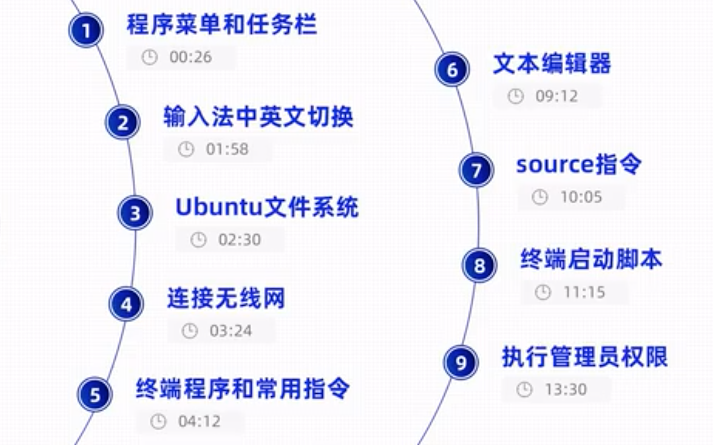

## 五、机器人操作系统ROS的安装心得以及rosdep问题的处理

**5.1、导入ROS安装步骤**

进入ROS官方网站[ros.org](https://www.ros.org)，进入到[Getting Started](https://www.ros.org/blog/getting-started/)页面，选择对应于`Ubuntu`版本的`ROS`，点击`install`，进入到官方安装文档中，接着一步一步操作即可。

**5.2、导入ROS安装源**

- 确保`Ubuntu Universe repository`软件源已经添加。**这里也可以改用国内的安装源。**

```bash
sudo apt install software-properties-common

sudo add-apt-repository universe
```

- 设置安装密钥

```bash
sudo apt update && sudo apt install curl -y

sudo curl -sSL https://raw.githubusercontent.com/ros/rosdistro/master/ros.key -o /usr/share/keyrings/ros-archive-keyring.gpg
```

- 将安装源和密钥添加到源列表中

```bash
echo "deb [arch=$(dpkg --print-architecture) signed-by=/usr/share/keyrings/ros-archive-keyring.gpg] http://packages.ros.org/ros2/ubuntu $(. /etc/os-release && echo $UBUNTU_CODENAME) main" | sudo tee /etc/apt/sources.list.d/ros2.list > /dev/null
```

**5.3、下载安装ROS**

- 更新软件源列表以及现有包
  
```bash
sudo apt update

sudo apt upgrade
```

- 安装`ROS`，`ros-humble-desktop`包含ROS, RViz, 案例、教程等。

```bash
sudo apt install ros-humble-desktop
```

- 安装`ROS-Base`，包含常用的一些库，例如通信库、消息包、命令行工具等非GUI工具。

```bash
sudo apt install ros-humble-ros-base
```

- 安装开发工具，包含编译器以及一些其他用于编译ROS库的工具。

```bash
sudo apt install ros-dev-tools
```

**5.4、环境参数设置**

```bash
# Replace ".bash" with your shell if you're not using bash
# Possible values are: setup.bash, setup.sh, setup.zsh
source /opt/ros/humble/setup.bash
```

**5.5、rosdep初始化**

`ros2`中好像不需要了，暂时跳过。

视频地址：[https://www.bilibili.com/video/BV1aP41137k9](https://www.bilibili.com/video/BV1aP41137k9)

**5.6、运行一些案例**

根据文档中给的案例来运行。

## 六、APT源，ROS的软件包应用商店

软件包网站入口[index.ros.org](https://index.ros.org)

视频地址：[https://www.bilibili.com/video/BV1Xt4y177iW](https://www.bilibili.com/video/BV1Xt4y177iW)

## 七、在Github上寻找安装ROS软件包

在[Github](https:://github.com)上下载的ROS软件仓库，需要自己重新编译才能运行。

大致步骤如下：

- 在主目录下创建一个目录作为工作目录，再在工作目录下，创建一个`src`文件夹
- 将Github上的ROS库源代码下载到`src`文件夹。其中，源代码目录下`scripts`文件夹下一般用于放置脚本文件和Python程序（包括包编译安装的脚本等）
- 运行`scripts`文件夹下脚本，安装编译相关依赖
- 在工作目录下，运行`catkin_make`命令，进行编译
- 使用`source`命令载入工作空间的环境设置，例如`source ~/工作目录/devel/setup.bash`（也可以将该命令加入到`~\.bashrc`文件夹中，这样就不需要每一次都需要设置环境了）
- 使用`roslaunch`运行编译好的`ROS`程序

视频地址：[https://www.bilibili.com/video/BV1dV4y1u758](https://www.bilibili.com/video/BV1dV4y1u758)

## 八、ROS开发神器VisualStudioCode的安装和设置

这里VSCode的安装就不多说，这里介绍几个ROS相关插件：

- `ROS`插件
- `CMake Tools`插件
- `Bracket Pair Colorizer 2`插件：不同层级的大括号中使用不同颜色

还有一些VSCode的设置，包括编译的默认设置，拼写错误的检查等可以看下面视频。

视频地址：[https://www.bilibili.com/video/BV1rg411S7k3](https://www.bilibili.com/video/BV1rg411S7k3)

## 九、超级终端Terminator ROS开发得力助手

自带的终端，当开启多个时，在操作时不是特别方便，而`Terminator`可以竖直、水平分割，即一个窗口中显示多个终端会相对方便一些，如下图所示。


如果有`Terminator`使用需求，可以看如下视频，还有视频中还有相关快捷键的讲解、以及消除输入法快捷键`Ctrl + shift + E`与`Terminator`快捷键的冲突。

```txt
Ctrl + shift + E 橫向分屏
Ctrl + Shift + O 纵向分屏
Ctrl + Shift + W 取消分屏
Alt  + 方向键     移动焦点
```

视频地址：[https://www.bilibili.com/video/BV1Ee4y1o7Vo](https://www.bilibili.com/video/BV1Ee4y1o7Vo)

## 十、ROS的基础单元：Node节点和Package包

Node节点是ROS的基础单元，可以看作是实现了一个功能点（一个Node是一个main函数），而Package包是节点的容器，包含有一组相关联的节点。

节点不能脱离包，独立存在。

视频地址：[https://www.bilibili.com/video/BV1Ee4y1o7Vo](https://www.bilibili.com/video/BV1Ee4y1o7Vo)

## 十一、初学ROS，年轻人的第一个Node节点

**11.1、创建Package软件包**

- 创建并进入`~/catkin_ws/src`文件夹里
- `catkin_create_pkg`命令创建包：catkin_create_pkg<包名＞<依赖项列表>
  - 例如：`catkin_create_pkg ssr_pkg rospy roscpp std_msgs`，其中`ssr_pkg`是包名，`rospy`、`roscpp`分别是对Python与C++语言支持的依赖，`std_msgs`是标准消息依赖。

创建完成后，在`~/catkin_ws/src`文件夹下会有一个`ssr_pkg`文件夹，并且包含空的`include`，`src`文件夹以及编译相关信息`CMakeLists.txt`，包的相关描述`package.xml`。

`roscd`命令在终端中进入指定软件包的文件地址。

**11.2、构建第一个包的步骤**

1. 使用catkin _create_pkg创建一个软件包
2. 在软件包的src文件夹下创建一个节点的cpp源码文件
3. 在节点的源码文件中include包含ROS的头文件
4. 构建一个main函数，并在函数的开头执行ros::init(）
5. 构建while循环，循环条件为ros::ok()
6. 在CMakeLists.txt中设置节点源码的编译规则
7. 编译运行

视频地址：[https://www.bilibili.com/video/BV1nG411V7HW](https://www.bilibili.com/video/BV1nG411V7HW)

## 十二、ROS的主要通讯方式：Topic话题与Message消息

**12.1、定义**

关于Topic话题与Message消息的定义，总结为以下几点内容：

- 话题Topic是节点间进行持续通讯的一种形式
- 话题通讯的两个节点通过话题的名称建立起话题通讯连接
- 话题中通讯的数据，叫做消息Message
- 消息Message通常会按照一定的频率持续不断的发送，以保证消息数据的实时性
- 消息的发送方叫做话题的发布者Publisher
- 消息的接收方叫做话题的订阅者Subsciber

博主使用群聊的例子，很形象的说明了Topic话题与Message消息，如下图所示。


**12.2、外延补充**

- 一个ROS节点网络中，可以同时存在多个话题
- 一个话题可以有多个发布者，也可以有多个订阅者
- 一个节点可以对多个话题进行订阅，也可以发布多个话题
- 不同的传感器消息通常会拥有各自独立话题名称，每个话题只有一个发布者
- 机器人速度指令话题通常会有多个发布者，但是同一时间只能有一个发言人


**12.3、Message消息类型**

可以在[index.ros.org](https://index.ros.org)网站中查看ROS提供的基础的消息类型`std_msgs`，也可以根据开发的需求自己定义Message

视频地址：[https://www.bilibili.com/video/BV1qa41137ED](https://www.bilibili.com/video/BV1qa41137ED)

## 十三、ROS中，使用C++编写Publisher发布者节点

**13.1、Publisher发布者的C++实现**

大致实现步骤如下：

- 确定话题名称和消息类型（需要注意的是：话题名称不能是中文）
- 在代码文件中include消息类型对应的头文件
- 在main函数中通过NodeHandler大管家发布一个话题并得到消息发送对象。
- 生成要发送的消息包并进行发送数据的赋值
- 调用消息发送对象的publish()函数将消息包发送到话题当中

案例代码如下：

```C++
#include <ros/ros .h>
#include <std msgs/String.h>

int main(int argc, char *argv[])
{
  // “chao_node”为节点名
  ros::init(argc,argv, "chao_node");
  printf("我的枪去而复返，你的生命有去无回!\n");
  
  // 构建节点句柄以及发布对象
  ros::NodeHandle nh;
  ros::Publisher pub = nh.advertise<std msgs::String>("kuai_shang_che_kai_hei", 10); // 第一个参数是topic名称，第二个参数是缓存的消息数
  
  // 控制帧率为每秒10帧
  ros::Rate loop rate(10);
  
  while(ros::ok()){
    printf("我要开始刷屏了 !\n");
    
    // 发布消息
    std msgs::String msg;
    msg.data ="国服马超，带飞";
    pub.publish(msg);

    // 控制帧率
    loop rate.sleep();
  }
  return 0;
}
```

**13.2、常用工具/命令**

- `rostopic`命令
  - `rostopic list`，列出当前系统中所有活跃着的话题
  - `rostopic echo 主题名称`，显示指定话题中发送的消息包内容
  - `rostopic hz 主题名称`，统计指定话题中消息包发送频率

视频地址：[https://www.bilibili.com/video/BV1eg411S7ap](https://www.bilibili.com/video/BV1eg411S7ap)

## 十四、ROS中，使用C++编写Subscriber订阅者节点

**14.1、Subscriber订阅者的C++实现**

大致实现步骤如下：

- 确定话题名称和消息类型
- 在代码文件中include <ros.h> 和消息类型对应的头文件
- 在main函数中通过NodeHandler大管家订阅一个话题并设置消息接收回调函数
- 定义一个回调函数，对接收到的消息包进行处理
- main函数中需要执行ros::spinOnce()，让回调函数能够响应接收到的消息包

案例代码如下：

```C++
#include <ros/ros.h>
#include <std msgs/String.h>

// 回调函数
void chao_callback(std_msgs::String msg){
  ROS_INFO(msg.data.c_str());
}

// 回调函数
void yao_callback(std_msgs::String msg){
  ROS_WARN(msg.data.c_str());
}

int main(int argc, char *argv[]){
  
  setlocale(LC_ALL,"zh_CN.UTF-8"); // 中文输出支持
  
  ros::init(argc, argv, "ma node");

  ros::NodeHandle nh;
  ros::Subscriber sub = nh.subscribe("kuai_shang_che_kai_hei_qun", 10, chao_callback);
  ros::Subscriber sub_2 = nh.subscribe("gie_gie_dai_wo", 10,yao_callback);

  while (ros::ok()){
    ros::spinOnce();
  }
}
```

**14.2、常用工具/命令**

- `rqt_graph`命令，图形化显示当前系统活跃的节点以及节点间的话题通讯关系

视频地址：[https://www.bilibili.com/video/BV1it4y177ov](https://www.bilibili.com/video/BV1it4y177ov)

## 十五、ROS中，使用launch文件一次启动多个节点

launch文件是遵循XML语法的描述文件，批量启动ROS节点是它的功能之一（还有其他功能这里暂时还不知道，后面再填一下这个坑）。

**15.1、编写运行launch文件**

launch文件只需要放在软件包下的文件夹（包括子目录）下即可，当我们使用指令启动launch文件时，会自动对指定软件包的目录进行逐层的遍历搜索。

通常创建一个launch文件夹，将launch文件放在该文件夹下，直观且方便管理。

`xx.launch`文件格式如下：

```xml
<launch>

<node pkg="ssr_pkg" type="yao_node" name="yao node"/>

<node pkg="ssr_pkg" type="chao_node" name="chao_node" launch-prefix="gnome-terminal -e"/>

<node pkg="atr_pkg" type="ma_node" name="ma_node" output="screen"/>

</launch>
```

**15.2、launch文件小结**

- 使用`launch`文件，可以通过`roslaunch`指令一次启动多个节点。
- 在`launch`文件中，为节点添加`output="screen"`属性，可以让节点信息输出到终端中。（ROS_WARN不受该属性控制）
- 在`launch`文件中，为节点添加`launch-prefix="gnome-terminal -e"`属性，可以让节点单独运行在一个独立终端中。

视频地址：[https://www.bilibili.com/video/BV1sU4y1z7mw](https://www.bilibili.com/video/BV1sU4y1z7mw)

## 十六、ROS中，使用Python编写Publisher发布者节点

**16.1、与用C++编写的软件包的不同**

python编写软件包，只需要在创建好软件包之后**编译一次**，即将新建的软件包加入到ROS软件包列表即可（让ROS能找到新建的软件包），后面无论是新增节点、修改已有节点，都不再需要再次编译，而C++在每次修改之后，都需要重新编译。

**16.2、C++与Python编写发布者节点的步骤的不同**

C++与Python编写发布者节点的步骤非常相似，如下所示。

- C++编写发布者节点的步骤
  - 召唤ROS大管家NodeHandle
  - 向ROS大管家NodeHandle申请初始化节点
  - 告诉ROS大管家NodeHandle需要发布的话题名称，并向他索要能够发送消息包的发布对象pub
  - 开启一个while循环，不停的使用pub对象发布消息包
- Python编写发布者节点的步骤
  - 召唤ROS大管家rospy
  - 向ROS大管家rospy申请初始化节点
  - 告诉ROS大管家rospy需要发布的话题名称，并白他索要能够发送消息包的发布对象pub
  - 开启一个while循环，不停的使用pub对象发布消息包

**16.3、Python编写Publisher发布者节点**

- 在软件包目录下创建一个`scripts`文件夹，将python文件创建在这个文件夹下
- 编写python代码
  
  ```python
  #!/usr/bin/env python3
  #coding=utf-8

  import rospy
  from std_msgs.msg import String

  if __name__ == "__main__":
      rospy.init_node("chao_node")
      
      rospy.logwarn("我的枪去而复返，你的生命有去无回!")

      pub = rospy.Publisher("kuai_shang_che_kai_hei_qun",String,queue size=10)

      rate = rospy.Rate(10)

      while not rospy.is_shutdown():
          rospy.loginfo("我要开始刷屏了")
          msg = String()
          msg.data = "国服马超，带飞"
          pub.publish(msg)
          rate.sleep()
  ```

- 赋给Python文件可执行权限`chmod +x xx.py`
- 运行节点`rosrun 包名  python文件`，命令类似`rosrun ssr_pkg chao_node.py`

视频地址：[https://www.bilibili.com/video/BV1kg411S7Ev](https://www.bilibili.com/video/BV1kg411S7Ev)

## 十七、ROS中，使用Python编写Subscriber订阅者节点

**17.1、C++与Python编写订阅者节点的步骤的不同**

C++与Python编写订阅者节点的步骤非常相似，如下所示。

- C++编写订阅者节点的步骤
  - 召唤ROS大管家NodeHandle
  - 向ROS大管家NodeHandle申请初始化节点
  - 构建一个回调函数，用于处理从话题中接收到的消息包数据
  - 告诉ROS大管家NodeHandle需要订阅的话题名称，并设置接收消息包的回调函数
  - 调用ROS的spin()函数
- Python编写订阅者节点的步骤
  - 召唤ROS大管家rospy
  - 向ROS大管家rospy申请初始化节点
  - 构建一个回调函数，用于处理从话题中接收到的消息包数据
  - 告诉ROS大管家rospy需要订阅的话题名称，并设置接收消息包的回调函数
  - 调用ROS的spin()函数

**17.2、Python编写Subscriber订阅者节点**

- 在软件包目录下创建一个`scripts`文件夹，将python文件创建在这个文件夹下
- 编写python代码
  
  ```python
  #!/usr/bin/env python3
  #coding=utf-8
  import rospy
  from std_msgs.msg import String

  def chao_callback(msg):
      rospy.loginfo(msg.data)

  if __name__ == "__main__":
      rospy.init_node("ma_node")
      
      sub = rospy.Subscriber("kuai shang che kai hei gun",string,chao callback,queue size=10)
      
      rospy.spin()
  ```

- 赋给Python文件可执行权限`chmod +x xx.py`
- 运行节点`rosrun 包名  python文件`，命令类似`rosrun atr_pkg ma_node.py`

**17.3、Python编写的软件包launch文件编写**

`xx.launch`文件格式如下：

```xml
<launch>

<node pkg="ssr_pkg" type="yao_node.py" name="yao node"/>

<node pkg="ssr_pkg" type="chao_node.py" name="chao_node" launch-prefix="gnome-terminal -e"/>

<node pkg="atr_pkg" type="ma_node.py" name="ma_node" output="screen"/>

</launch>
```

这里需要注意的是：`type`属性中是`python`文件名称包含后缀，而C++编写的软件包中，没有".cpp"后缀，因为这里是可执行文件的名称，C++编译生成的可执行文件与Python的不。

视频地址：[https://www.bilibili.com/video/BV1St4y177vZ](https://www.bilibili.com/video/BV1St4y177vZ)

## 十八、ROS机器人运动控制

将机器人运动看做为矢量运动（前后、左右、上下平移）和旋转运动（滚转运动、俯仰运动、自转运动等）。

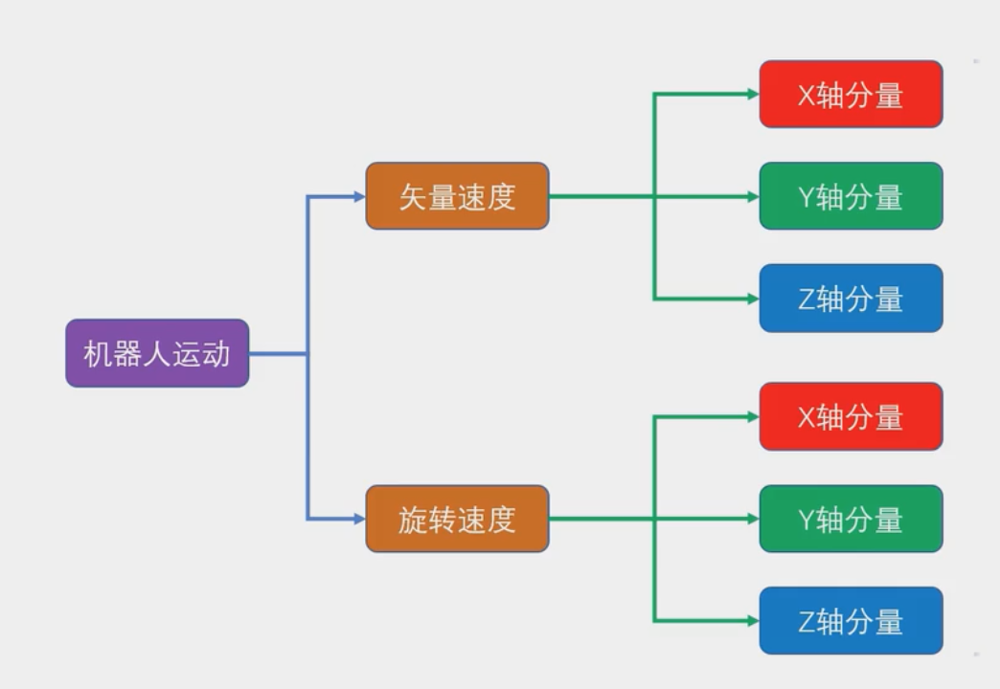

**18.1、矢量运动坐标系**

以机器人底盘中心作为坐标系原地，伸出右手，以如下图所示，大拇指所指方向作为Z轴，食指所指方向作为X轴，中指所指方向作为Y轴。（运动单位为米每秒）


**18.2、旋转运动坐标系**

伸出右手，大拇指指向X轴正方向，其他四个手指握拳的方向即是滚转运动的正方向，Y轴、Z轴类似，如下图所示。（运动单位为弧度每秒，$1$弧度 = $180 / \pi$ 度）

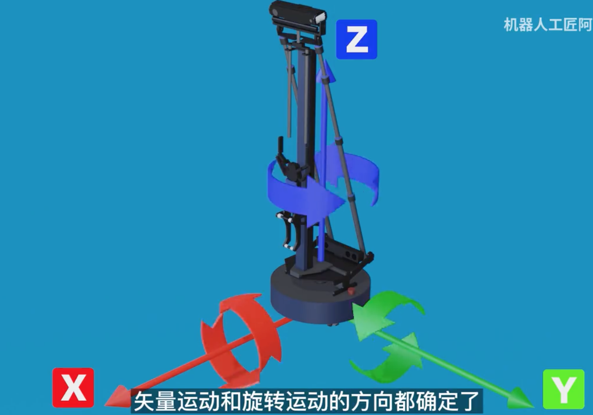

**18.3、速度控制消息包**

可以在[index.ros.org](https://index.ros.org)中搜索`geometry_msgs`，查看速度控制消息包`Twist`消息，其中包含矢量速度`linear`，旋转速度`angular`。

```C++
Vector3  linear
Vector3  angular
```

**18.4、机器人运动控制流程**

速度控制节点发消息给速度控制话题`/cmd_vel`（约定俗成的名字）然后通过机器人核心节点控制机器人运动，如下图所示。


视频地址：[https://www.bilibili.com/video/BV1od4y1g7Ye](https://www.bilibili.com/video/BV1od4y1g7Ye)

## 十九、ROS中，用C++实现机器人运动控制

**19.1、使用wpr_simulation工程进行仿真**

使用ROS仿真工程[wpr_simulation](https://github.com/6-robot/wpr_simulation)进行运动控制仿真。

- 下载`wpr_simulation`源码：`git clone https://github.com/6-robot/wpr_simulation`
- 进入工程目录的`wpr_simulation/scripts`目录
- 执行`./install_for_noetic.sh`下载安装依赖项（这里需要对应ROS版本）
- 回到最外层目录，执行`catkin_make`进行编译
- 启动模拟器`roslaunch wpr_simulation wpb_simple.launch`
- 运行运动控制的示例程序`rosrun wpr_simulation demo_vel_ctrl`

**19.2、机器人运动控制实现思路**

大致思路如下：

- 构建一个新的软件包，包名叫做vel_pkg，例如：`catkin_create_pkg vel_pkg roscpp rospy geometry_msgs`
- 在软件包中新建一个节点，节点名叫做vel_node
- 在节点中，向ROS大管家NodeHandle申请发布话题/cmd_vel并拿到发布对象vel_pub
- 构建一个geometry_msgs/Twist类型的消息包vel_msg，用来承载要发送的速度值
- 开启一个while循环，不停的使用vel_pub对象发送速度消息包vel_msg

实现代码如下：

```C++
#include <ros/ros.h>
#include <geometry_msgs/Twist.h>

int main(int argc, char *argv[]){
  ros::init(argc ,argv ,"vel_node");

  ros::NodeHandle n;
  ros::Publisher vel_pub = n.advertise<geometry_msgs::Twist>("/cmd_vel",10);

  geometry_msgs::Twist vel_msg;
  vel_msg.linearx = 0.1;
  vel msg.linear.y = 0;
  vel msg.linear.z = 0;
  vel msg.angular.x =0;
  vel msg.angular.y =0;
  vel msg.angular.z =0;
  
  ros::Rate r(30);
  while (ros::ok()){
    vel_pub.publish(vel_msg);
    r.sleep();
  }
  
  return 0;
}
```

视频地址：[https://www.bilibili.com/video/BV1de4y1h7H5](https://www.bilibili.com/video/BV1de4y1h7H5)

## 二十、在ROS中，使用Python编写运动控制功能

没有机器人，使用仿真器进行仿真，过程可以查看[19.1、使用wpr\_simulation工程进行仿真](#191使用wpr_simulation工程进行仿真)。

**20.1、机器人运动控制实现思路**

- 构建一个新的软件包，包名叫做vel_pkg
- 在软件包中新建一个节点，节点名叫做vel_node.py
- 在节点中，向ROS大管家rospy申请发布话题/cmd_vel，并拿到发布对象vel_pub
- 构建一个geometry_msgs/Twist类型的消息包vel_msg，用来承载要发送的速度值
- 开启一个while循环，不停的使用vel_pub对象发送速度消息包vel_msg

实现代码如下：

```Python
#!/usr/bin/env python3
# coding=utf-8

import rospy
from geometry_msgs.msg import Twist

if __name__ == "__main__":
    rospy.init_node("vel_node")
    
    vel_pub = rospy.Publisher("cmd_vel", Twist, queue_size=10)
    vel_msg = Twist()
    vel_msg.linear.x = 0.1
    
    rate = rospy.Rate(30)
    while not rospy.is_shutdown():
        vel_pub.publish(vel_msg)
        rate.sleep()
```

主要注意的是：python文件需要加上执行权限，另外可以对照示例代码`wpr_simulation/scripts/demo_vel_ctrl.py`

视频地址：[https://www.bilibili.com/video/BV1pe4y1h7zT](https://www.bilibili.com/video/BV1pe4y1h7zT)

## 二十一、激光雷达工作原理

**21.1、激光雷达相关说明**

- 主要作用：探测周围障碍物的分布情况
- 按照测量维度分为：单线雷达、多线雷达
- 按照测量原理分为：三角测距雷达、TOF雷达
- 按照工作方式分为：机械旋转雷达、固态雷达
- 激光雷达的种类繁多，但是在ROS中呈现的数据格式是一样的，只是在数据完整度和精度上会有差异

**21.2、激光雷达工作原理**

- 以TOF激光雷达为例，激光雷达分为两部分：固定底座、可旋转的头部结构，其中，在雷达的头部设置了一个红外激光的发射器和一个红外激光的接收器
- 红外发射器发射一束激光，遇到障碍物会反射回来被红外接收器捕获，通过计时器测量激光发射和接收的间隔时长乘上光速就可以计算出来回的飞行距离，飞行距离除以2得到障碍物距离（`时间 x 光速 = 飞行距离，飞行距离 / 2 = 障碍物距离`）
- 激光雷达测量完一个方向的障碍物距离之后，旋转一个角度，再发射激光，接收激光，计算障碍物距离，再旋转一个角度，再发射再接受，计算，一直重复这个操作，直到雷达旋转一周，完成一次对周围障碍物的探测
- 重复对周围障碍物进行探测，只要激光探测的频率足够高，旋转速度足够快，就能实时的刷新周围障碍物的分布状况

视频地址：[https://www.bilibili.com/video/BV1He41137KK](https://www.bilibili.com/video/BV1He41137KK)

## 二十二、ROS中，使用RViz观测传感器数据

**22.1、`RViz`工具的介绍**

`RViz, (The Robot Visualization Tool)`是一个方便我们对机器人的状态进行实时观测的辅助工具（可视化），例如，可以将传感器采集到的数据以图形化的方式显示在软件中，另外，也可以将机器人运算处理的中间结果和即将要执行的目标指示可视化，比如，机器人对空间中某个物体进行识别之后，可以在软件中将其框选标注出来，又比如，显示机器人到某一个位置的路径规划。

对于`RViz`的使用，包括RViz界面的介绍，添加机器人模型、添加激光雷达显示、`Gazebo`添加仿真物体、保存并加载`RViz`配置等操作可以看博主发布的视频。

`roslaunch wpr_simulation wpb_rviz.launch`根据`Gazebo`仿真启动配置好的`rviz`界面

**22.2、`Gazebo`与`RViz`区别与联系**

- `Gazebo`是模拟真实机器人发出的传感器数据的工具，`RViz`是接受传感器数据并进行显示的工具
- 在现实世界的机器人系统中，`Gazebo`是不存在的，`Gazebo`仿真的角色会被真实的实体机器人和真实的环境所代替
- 而`RViz`不需要知道数据到底是来自`Gazebo`仿真还是实体机器，它只需要接收数据并显示即可
- 没有`RViz`也不会影响机器人ROS系统运行，只有在需要观测数据的实时变化的时候，才会使用`RViz`

视频地址：[https://www.bilibili.com/video/BV1He4y1h7Mm](https://www.bilibili.com/video/BV1He4y1h7Mm)

## 二十三、ROS系统中的激光雷达消息包格式

在[index.ros.org](https://index.ros.org)网站中，搜索`sensor_msgs`，再查看激光雷达消息包格式`LaserScan`，消息包内容如下所示，

- Header header，消息头
  - header中的timestamp (时间戳)表示本次扫描中接收到第一束测距激光反射信号的时间
  - header中的frame_id指明了激光雷达的基准坐标系
- float32 angle_min，扫描的起始角度(单位: 弧度)
- float32 angle_max，扫描的终止角度(单位: 弧度)
- float32 angle_increment，相邻两次测距的旋转夹角(单位: 弧度)
- float32 time_increment，相邻两次测距的时间差(单位: 秒)
- float32 scan_time，两次扫描的起始时间差(单位: 秒)（扫描一圈的时间）
- float32 range_min，有效测距范围的最小距离 (单位: 米)
- float32 range_max，有效测距范围的最大距离 (单位: 米)
- float32[] ranges，本次扫描的所有测距值(单位:米)（360个浮点数，不是所有值都有效）
- float32[] intensities，所有测距的返回信号强度 (单位由厂商自己定义)

视频地址：[https://www.bilibili.com/video/BV1wv4y1M7Sj](https://www.bilibili.com/video/BV1wv4y1M7Sj)

## 二十四、ROS中，用C++实现获取激光雷达数据

该过程需要使用仿真器产生模拟的激光雷达数据，仿真器包配置过程可以查看[19.1、使用wpr\_simulation工程进行仿真](#191使用wpr_simulation工程进行仿真)。

**24.1、激光雷达数据获取流程**

激光雷达数据获取流程如下图所示，激光雷达节点生成数据由模拟器生成，这里仅加入一个订阅者节点订阅雷达数据话题`/scan`即可。


大致流程如下：

- 构建一个新的软件包，包名叫做lidar_pkg
- 在软件包中新建一个节点，节点名叫做lidar_node
- 在节点中，向ROS大管家NodeHandle申请订阅话题/scan，设置回调函数为LidarCallback()
- 构建回调函数LidarCallback()，用来接收和处理雷达数据
- 调用ROS_INFO()显示雷达检测到的前方障碍物距离

示例代码如下，示例代码也可以在`wpr_simulation/src/demo_lidar_data.cpp`中找到：

```C++
#include <ros/ros .h>
#include <sensor_msgs/LaserScan.h>

void LidarCallback(const sensor_msgs::LaserScan msg){
    float fMidDist = msg.ranges[180];
    ROS_INFO("前方测距 ranges[180] = %f 米"，fMidDist);
}

int main(int argc, char *argv[]){
  
    setlocale(LC ALL,""):
    ros::init(argc, argv,"lidar_node");

    ros::NodeHandle n:
    ros::Subscriber lidar_sub = n.subscribe("/scan",10, &LidarCallback);
    
    ros::spin();
    
    return 0;
}
```

视频地址：[https://www.bilibili.com/video/BV1kG411G7ev](https://www.bilibili.com/video/BV1kG411G7ev)

## 二十五、ROS中，用Python实现获取激光雷达数据

大致流程如下：

- 构建一个新的软件包，包名叫做lidar_pkg
- 在软件包中新建一个节点，节点名叫做lidar_node.py
- 在节点中，向ROS大管家rospy申请订阅话题/scan，并设置回调函数为LidarCallback()
- 构建回调函数LidarCallback() ，用来接收和处理雷达数据
- 调用loginfo()显示雷达检测到的前方障碍物距离

示例代码如下，示例代码也可以在`wpr_simulation/scripts/demo_lidar_data.py`中找到：

```Python
#!/usr/bin/env python3
# coding=utf-8

import rospy
from sensor_msgs.msg import LaserScan

# 激光雷达回调函数
def lidar_callback(msg):
    number = len(msg.ranges)
    rospy.loginfo("雷达测距数量 = %d",number)
    middle = number//2
    rospy.logwarn("正前方测距数值 = %f 米",msg.ranges[middle])

# 主函数
if __name__ == "__main__":
    rospy.init_node("lidar_node")
    # 订阅激光雷达的数据话题
    lidar_sub = rospy.Subscriber("/scan",LaserScan,lidar_callback,queue_size=10)
    rospy.spin()

```

视频地址：[https://www.bilibili.com/video/BV19g411S7uK](https://www.bilibili.com/video/BV19g411S7uK)

## 二十六、ROS中，用C++实现激光雷达避障

大致流程如下：

- 让大管家 NodeHandle 发布速度控制话题/cmd_vel
- 构建速度控制消息包 vel_cmd
- 根据激光雷达的测距数值，实时调整机器人运动速度，避开障碍物


示例代码如下，示例代码也可以在`wpr_simulation/src/demo_lidar_behavior.cpp`中找到：

```C++
#include <ros/ros.h>
#include <std_msgs/String.h>
#include <sensor_msgs/LaserScan.h>
#include <geometry_msgs/Twist.h>

ros::Publisher vel_pub;
static int nCount = 0;

void LidarCallback(const sensor_msgs::LaserScan msg)
{
    int nNum = msg.ranges.size();
    
    int nMid = nNum/2;
    float fMidDist = msg.ranges[nMid];
    ROS_INFO("前方测距 ranges[%d] = %f 米", nMid, fMidDist); 

    if(nCount > 0)
    {
        nCount--;
        return;
    }

    geometry_msgs::Twist vel_cmd;
    if(fMidDist < 1.5f)
    {
        vel_cmd.angular.z = 0.3;
        nCount = 50;
    }
    else
    {
        vel_cmd.linear.x = 0.05;
    }
    vel_pub.publish(vel_cmd);
}

int main(int argc, char** argv)
{
    setlocale(LC_ALL,"");
    ros::init(argc,argv,"demo_lidar_behavior");
    
    ros::NodeHandle n;
    ros::Subscriber lidar_sub = n.subscribe("/scan", 10, &LidarCallback);
    vel_pub = n.advertise<geometry_msgs::Twist>("/cmd_vel",10);

    ros::spin();
}
```

视频地址：[https://www.bilibili.com/video/BV1ia41137bK](https://www.bilibili.com/video/BV1ia41137bK)

## 二十七、ROS中，用Python实现激光雷达避障

示例代码如下，示例代码也可以在`wpr_simulation/scripts/demo_lidar_behavior.py`中找到：

```Python
#!/usr/bin/env python3
# coding=utf-8

import rospy
from sensor_msgs.msg import LaserScan
from geometry_msgs.msg import Twist

count = 0

# 激光雷达回调函数
def lidar_callback(msg):
    global vel_pub
    global count
    middle = len(msg.ranges)//2
    dist = msg.ranges[middle]
    rospy.loginfo("正前方测距数值 = %f 米",dist)
    vel_cmd = Twist()
    if count > 0:
        count = count -1
        rospy.logwarn("持续转向 count = %d",count)
        return
    if dist < 1.5:
        vel_cmd.angular.z = 0.3
        count = 50
    else:
        vel_cmd.linear.x = 0.05
    vel_pub.publish(vel_cmd)

# 主函数
if __name__ == "__main__":
    rospy.init_node("lidar_behavior")
    # 订阅激光雷达的数据话题
    lidar_sub = rospy.Subscriber("scan",LaserScan,lidar_callback,queue_size=10)
    # 发布机器人运动控制话题
    vel_pub = rospy.Publisher("cmd_vel",Twist,queue_size=10)
    rospy.spin()
```

视频地址：[https://www.bilibili.com/video/BV1Qa41137ki](https://www.bilibili.com/video/BV1Qa41137ki)

## 二十八、ROS中的IMU惯性测量单元消息包

在[index.ros.org](https://index.ros.org)网站中，搜索`sensor_msgs`，再查看IMU(Inertial Measurement Unit)惯性单元消息包格式`Imu`，消息包内容如下所示，

- std_msgs/Header header，消息包头，包含时间戳与坐标系id
- geometry_msgs/Quaternion orientation，xyzw四元数，描述机器人空间姿态
- float64[9] orientation_covariance，协方差矩阵
- geometry_msgs/Vector3 angular_velocity，角速度
- float64[9] angular_velocity_covariance，协方差矩阵
- geometry_msgs/Vector3 linear_acceleration，矢量加速度
- float64[9] linear_acceleration_covariance，协方差矩阵

其中，

- 加速度的数值单位是 米/秒^2，旋转速度的数值单位为 弧度/秒
- 如果协方差数值已知，就将其填充到协方差矩阵中，若协方差数值未知，则将协方差矩阵全部置为零。
- 若协方差矩阵对应的数值不存在(比如IMU没有输出orientation姿态数据)，那么该协方差矩阵的第一个数值置为-1。
- 如果要使用这个消息包里的某个数据，需要先对其协方差矩阵的第一个数值进行一个判断:如果数值为-1，表明要使用的数据是不存在的，不要再去读取它。

视频地址：[https://www.bilibili.com/video/BV1u94y1X7hF](https://www.bilibili.com/video/BV1u94y1X7hF)

## 二十九、ROS中，使用C++实现IMU数据获取

**与IMU数据获取相关的三个通信话题**

- `imu/data_raw` (消息包：`sensor_msgs/Imu`）
  - 加速度计输出的矢量加速度 和 陀螺仪输出的旋转角速度
- `imu/data` (消息包：`sensor_msgs/lmu`)
  - `/imu/data_raw`的数据 再加上 融合后的四元数姿态描述
- `imu/mag` (消息包：`sensor_msgs/MagneticField`)
  - 磁强计输出磁强数据（九轴IMU）

**IMU数据获取步骤**

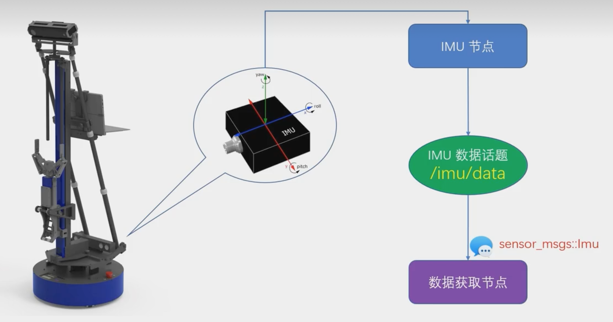

- 构建一个新的软件包，包名叫做`imu_pkg`
- 在软件包中新建一个节点，节点名叫做`imu_node`
- 在节点中，向ROS大管家NodeHandle申请订阅话题`/imu/data`并设置回调函数为`IMUCallback()`
- 构建回调函数`IMUCallback()`，用来接收和处理IMU数据
- 使用TF工具将四元数转换成欧拉角
- 调用`ROS_INFO()`显示转换后的欧拉角数值

**示例代码**

示例代码也可以在`wpr_simulation/src/demo_imu_data.cpp`中找到：

```C++
#include "ros/ros.h"
#include "sensor_msgs/Imu.h"
#include "tf/tf.h" // 坐标转换

// IMU 回调函数
void IMUCallback(const sensor_msgs::Imu msg)
{
    // 检测消息包中四元数数据是否存在
    if(msg.orientation_covariance[0] < 0)
        return;
    // 四元数转成欧拉角
    tf::Quaternion quaternion(
        msg.orientation.x,
        msg.orientation.y,
        msg.orientation.z,
        msg.orientation.w
    );
    double roll, pitch, yaw;
    tf::Matrix3x3(quaternion).getRPY(roll, pitch, yaw);
    // 弧度换算成角度
    roll = roll*180/M_PI;
    pitch = pitch*180/M_PI;
    yaw = yaw*180/M_PI;
    ROS_INFO("滚转= %.0f 俯仰= %.0f 朝向= %.0f", roll, pitch, yaw);
}

int main(int argc, char **argv)
{
    setlocale(LC_ALL, "");
    ros::init(argc,argv, "imu_node"); 

    ros::NodeHandle n;
    // 订阅 IMU 的数据话题
    ros::Subscriber sub = n.subscribe("imu/data", 100, IMUCallback);
    ros::spin();

    return 0;
}
```

视频地址：[https://www.bilibili.com/video/BV1Ge4y1o7XS](https://www.bilibili.com/video/BV1Ge4y1o7XS)

## 三十、ROS中，使用Python实现IMU数据获取

**IMU数据获取步骤**

- 构建一个新的软件包，包名叫做imu_pkg
- 在软件包中新建一个节点，节点名叫做imu_node.py
- 在节点中，向ROS大管家rospy申请订阅话题/imu/data，回调函数为imu_callback()。
- 构建回调函数imu_callback()， 用来接收和处理IMU数据
- 使用TF工具将四元数转换成欧拉角，
- 调用loginfo()显示转换后的欧拉角数值

**示例代码**

示例代码也可以在`wpr_simulation/scripts/demo_imu_data.py`中找到：

```python
#!/usr/bin/env python3
# coding=utf-8

import rospy
from sensor_msgs.msg import Imu
from tf.transformations import euler_from_quaternion
import math

# IMU 回调函数
def imu_callback(msg):
    if msg.orientation_covariance[0] < 0:
        return
    # 四元数转成欧拉角
    quaternion = [
        msg.orientation.x,
        msg.orientation.y,
        msg.orientation.z,
        msg.orientation.w
    ]
    (roll,pitch,yaw) = euler_from_quaternion(quaternion)
    # 弧度换算成角度
    roll = roll*180/math.pi
    pitch = pitch*180/math.pi
    yaw = yaw*180/math.pi
    rospy.loginfo("滚转= %.0f 俯仰= %.0f 朝向= %.0f", roll, pitch, yaw)

# 主函数
if __name__ == "__main__":
    rospy.init_node("imu_node")
    # 订阅 IMU 数据话题
    imu_sub = rospy.Subscriber("/imu/data",Imu,imu_callback,queue_size=10)
    rospy.spin()
```

视频地址：[https://www.bilibili.com/video/BV1cB4y137kh](https://www.bilibili.com/video/BV1cB4y137kh)

## 三十一、ROS中，用C++实现IMU航向锁定

**IMU航向锁定流程**

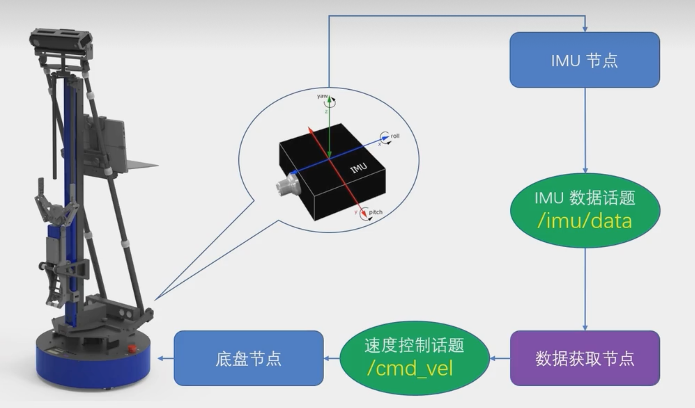

- 让大管家 NodeHandle 发布速度控制话题`/cmd_vel`
- 设定一个目标朝向角，当姿态信息中的朝向角和目标朝向角不一致时，控制机器人转向目标朝向角

**示例代码**

示例代码也可以在`wpr_simulation/src/demo_imu_behavior.cpp`中找到：

```C++
#include "ros/ros.h"
#include "sensor_msgs/Imu.h"
#include "tf/tf.h"
#include "geometry_msgs/Twist.h"

// 速度消息发布对象（全局变量）
ros::Publisher vel_pub;

// IMU 回调函数
void IMUCallback(const sensor_msgs::Imu msg)
{
    // 检测消息包中四元数数据是否存在
    if(msg.orientation_covariance[0] < 0)
        return;
    // 四元数转成欧拉角
    tf::Quaternion quaternion(
        msg.orientation.x,
        msg.orientation.y,
        msg.orientation.z,
        msg.orientation.w
    );
    double roll, pitch, yaw;
    tf::Matrix3x3(quaternion).getRPY(roll, pitch, yaw);
    // 弧度换算成角度
    roll = roll*180/M_PI;
    pitch = pitch*180/M_PI;
    yaw = yaw*180/M_PI;
    ROS_INFO("滚转= %.0f 俯仰= %.0f 朝向= %.0f", roll, pitch, yaw);
    // 速度消息包
    geometry_msgs::Twist vel_cmd;
    // 目标朝向角
    double target_yaw = 90;
    // 计算速度
    double diff_angle = target_yaw - yaw;
    vel_cmd.angular.z = diff_angle * 0.01;
    vel_cmd.linear.x = 0.1;
    vel_pub.publish(vel_cmd);
}

int main(int argc, char **argv)
{
    setlocale(LC_ALL, "");
    ros::init(argc,argv, "demo_imu_behavior"); 

    ros::NodeHandle n;
    // 订阅 IMU 的数据话题
    ros::Subscriber sub = n.subscribe("imu/data", 100, IMUCallback);
    // 发布速度控制话题
    vel_pub = n.advertise<geometry_msgs::Twist>("/cmd_vel",10);
    ros::spin();

    return 0;
}
```

视频地址：[https://www.bilibili.com/video/BV1rU4y1z7Qs](https://www.bilibili.com/video/BV1rU4y1z7Qs)

## 三十二、ROS中，用Python实现IMU航向锁定

**IMU航向锁定流程**

- 让大管家 rospy 发布速度控制话题`/cmd_vel`
- 设定一个目标朝向角，当姿态信息中的朝向角和目标朝向角不一致时，控制机器人转向目标朝向角

**示例代码**

示例代码也可以在`wpr_simulation/scripts/demo_imu_behavior.py`中找到：

```Python
#!/usr/bin/env python3
# coding=utf-8

import rospy
from sensor_msgs.msg import Imu
from tf.transformations import euler_from_quaternion
import math
from geometry_msgs.msg import Twist

# IMU 回调函数
def imu_callback(msg):
    if msg.orientation_covariance[0] < 0:
        return
    # 四元数转成欧拉角
    quaternion = [
        msg.orientation.x,
        msg.orientation.y,
        msg.orientation.z,
        msg.orientation.w
    ]
    (roll,pitch,yaw) = euler_from_quaternion(quaternion)
    # 弧度换算成角度
    roll = roll*180/math.pi
    pitch = pitch*180/math.pi
    yaw = yaw*180/math.pi
    rospy.loginfo("滚转= %.0f 俯仰= %.0f 朝向= %.0f", roll, pitch, yaw)
    # 速度消息包
    vel_cmd = Twist()
    # 目标朝向角
    target_yaw = 90
    # 计算速度
    diff_angle = target_yaw - yaw
    vel_cmd.angular.z = diff_angle * 0.01
    vel_cmd.linear.x = 0.1
    global vel_pub # 全局变量
    vel_pub.publish(vel_cmd)

# 主函数
if __name__ == "__main__":
    rospy.init_node("imu_behavior")
    # 订阅 IMU 的数据话题
    imu_sub = rospy.Subscriber("/imu/data",Imu,imu_callback,queue_size=10)
    # 发布机器人运动控制话题
    vel_pub = rospy.Publisher("cmd_vel",Twist,queue_size=10)
    rospy.spin()
```

视频地址：[https://www.bilibili.com/video/BV1xW4y1B7c2](https://www.bilibili.com/video/BV1xW4y1B7c2)

## 三十三、ROS的标准消息包std_msgs

消息包是ROS系统中数据流动的主要形式

ROS消息包主要分为两个大类：标准消息包std_msgs、常用消息包common_msgs

标准消息包std_msgs，可粗略的分为三个类别：基础类型、数组类型、结构体类型

- 基础类型
  - Bool
  - Byte
  - Char
  - String
  - Int8, Int16, Int32, Int64
  - UInt8, UInt16, UInt32, UInt64
  - Float32, Float64
  - Empty (空类型，不传输任何数据，只是将消息包当作一个信号来处理)
- 数组类型（可变长数组，直接往数组中push_back()即可，一般用于程序还没有完全定型时，定型之后一般会重新定义一个新的类型）
  - ByteMultiArray
  - Int8MultiArray, Int16MultiArray, Int32MultiArray, Int64MultiArray
  - UInt8MultiArray, UInt16MultiArray, UInt32MultiArray, UInt64MultiArray
  - Float32MultiArray, Float64MultiArray
- 结构体类型
  - ColorRGBA：图像像素结构体
  - Duration：时间结构体，相对时间（时间差）
  - Time：时间结构体，绝对时间
  - Header：消息头，记录时间戳以及坐标系名称
  - MultiArrayLayout
  - MultiArrayDimension

以上这些标准消息类型，既可以单独使用，也可以包含在复杂的消息类型中作为成员使用

视频地址：[https://www.bilibili.com/video/BV1ia4y1f7E4](https://www.bilibili.com/video/BV1ia4y1f7E4)

## 三十四、ROS中的几何包geometry_msgs和传感器包sensor_msgs

ROS消息包主要分为两个大类：标准消息包std_msgs、常用消息包common_msgs

常用消息包common_msgs，包含以下九种消息包，最常用的是几何消息包geometry_msgs以及传感器消息包sensor_msgs

- actionlib_msgs, 行为消息包，与ROS的Action通讯机制配合使用的消息类型
- diagnostic_msgs, 诊断消息包，用于机器人自检
- geometry_msgs, 几何消息包
  - 加速度：Accel, AccelStamped, AccelWithCovariance, AccelWithCovarianceStamped
  - 惯性：Inertia，InertiaStamped
  - 空间点：Point, Point32, PointStamped
  - 多边形：Polygon, PolygonStamped
  - 空间位置：Pose, Pose2D, PoseArray, PoseStamped, PoseWithCovariance, PoseWithCovarianceStamped
  - 四元数：Quaternion, QuaternionStamped
  - 空间变换：Transform, TransformStamped
  - 空间方向：Twist, TwistStamped, TwistWithCovariance, TwistWithCovarianceStamped
  - 三维矢量：Vector3, Vector3Stamped
  - 扭矩：Wrench, WrenchStamped
- nav_msgs, 导航消息包
- sensor_msgs, 传感器消息包
  - 激光雷达：LaserScan, PointCloud2, LaserEcho, MultiEchoLaserScan
  - 单点测距：Range (超声和红外测距传感器)
  - 惯性测量：Imu, MagneticField
  - 彩色相机：CameraInfo, Image, CompressedImage, RegionOfInterest
  - 立体相机：CameraInfo, Image, ChannelFloat32, PointCloud, PointCloud2, PointField
  - 温度测量：Temperature
  - 湿度测量：RelativeHumidity
  - 照度测量：Illuminance (光照强度)
  - 流体压力：FluidPressure
  - 全球定位：NavSatFix, NavSatStatus
  - 运动关节：JointState, MultiDOFJointState
  - 控制手柄：Joy, JoyFeedback, JoyFeedbackArray
  - 电池状态：BatteryState
  - 时钟源：TimeReference
- shape_msgs, 形状消息包，用于描述多边形的信息
- stereo_msgs, 双目视觉消息包，描述了双目图像的一些计算信息
- trajectory_msgs, 运动轨迹消息包
- visualization_msgs, 图形显示消息包，我们在Rviz中进行线条、文字以及各种标识和符号的显示就是用的这个消息包的消息类型

其中，带有Stamped的消息包类型，都包含了一个header数据(时间和坐标系id)

视频地址：[https://www.bilibili.com/video/BV1TB4y1V7Su](https://www.bilibili.com/video/BV1TB4y1V7Su)

## 三十五、ROS中生成自定义消息类型

**生成自定义消息的步骤**

- 创建新软件包，依赖项`message_generation`、`message_runtime`，例如：`catkin_create_pkg qq_msgs roscpp rospy std_msgs message_generation message_runtime`
- 软件包添加`msg`目录，新建自定义消息文件，以`.msg`结尾
- 在`CMakeLists.txt`中，将新建的`.msg`文件加入`add_message_files()`
- 去掉`generate_messages()`注释符号，将依在`CMakeLists.txt`中，赖的其他消息包名称添加进去
- 在`CMakeLists.txt`中，将`message_runtime`加入`catkin_package()`的`CATKIN DEPENDS`
- 在`package.xml`中，将`message_generation`、`message_runtime`入`<build depend>`和`<exec depend>`
- 编译软件包，生成新的自定义消息类型

**消息包格式**

```msg
数据类型 变量名
```

**数据类型**

- Bool、Byte、Char
- String
- Int8, Int16, Int32, Int64、UInt8, UInt16, UInt32, UInt64
- Float32, Float64
- Duration、Time
- 可变长度数组array[]
- 固定长度数组array[n]
- 其他软件包定义的消息类型

**查看新的消息类型是否已经加入到了ROS消息列表中**

```bash
rosmsg show 包名/消息名
```

例如：`rosmsg show qq_msgs/Carry`

视频地址：[https://www.bilibili.com/video/BV1ZU4y1z7kN](https://www.bilibili.com/video/BV1ZU4y1z7kN)

## 三十六、ROS中使用自定义消息类型（C++节点）

**新消息类型在C++节点的应用**

- 在节点代码中，先`include`新消息类型的头文件，`#include<包名/新的消息类型名>`，例如`#include<qq_msgs/Carry>`
- 在发布或订阅话题的时候，将话题中的消息类型设置为新的消息类型
- 按照新的消息结构，对消息包进行赋值发送或读取解析
- 在`CMakeList.txt`文件的`find_package()`中，添加新消息包名称作为依赖项
- 在节点的编译规则中，添加一条`add_dependencies()`，将`新消息软件包名称_generate_messages_cpp`作为依赖项
- 在`package.xml`中，将新消息包添加到`<build depend>`和`<exec depend>`中去
- 运行`catkin_make`重新编译

在使用上，基本上与基本消息包类似，只是需要设置能找到自定义消息包依赖就行

视频地址：[https://www.bilibili.com/video/BV1zU4y1z7ZD](https://www.bilibili.com/video/BV1zU4y1z7ZD)

## 三十七、ROS中使用自定义消息类型（Python节点）

**新消息类型在C++节点的应用**

- 在节点代码中，先`import`新定义的消息类型，例如`from qq_msgs.msg import Carry`
- 在发布或订阅话题的时候，将话题中的消息类型设置为新的消息类型
- 按照新的消息结构，对消息包进行赋值发送或读取解析
- 在`CMakeList.txt`文件`find_package()`中，添加新消息包名称作为依赖项
- 在`package.xml`中，将新消息包添加到`<build depend>`和`<exec depend>`中去
- 重新编译，确保软件包进入ROS的包列表中

在使用上，基本上与基本消息包类似，只是需要设置能找到自定义消息包依赖就行

视频地址：[https://www.bilibili.com/video/BV1Yd4y1X7rM](https://www.bilibili.com/video/BV1Yd4y1X7rM)

## 三十八、ROS中的栅格地图格式

**ROS中的栅格地图**

- ROS中的栅格地图是正方形小格子组成的地图，每一个格子里面填入一个数值表示障碍物占据情况。

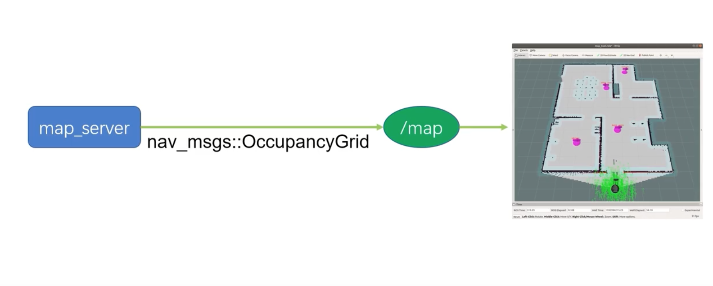

- 由ROS中`map_server`节点发送数据到`/map`话题，数据类型为`nav_msgs::OccupancyFrid`（占据栅格）,一般用100表示有障碍物占据，0表示没有障碍物占据，-1表示为未知状态
- 栅格的尺寸越小，区域划分的越精细，如下图所示，对于一个固定大小的地图来说，栅格越小，则栅格的数量就越多，也就意味着地图的数据量就越大，处理的时候，计算量就越大，因此，一般会给栅格边长（地图分辨率）设置为一个适当的尺寸（ROS中栅格地图的默认分辨率是0.05米）


**栅格地图消息格式**

栅格地图消息`nav_msgs/OccupancyGrid.msg`可在[index.ros.org](https://index.ros.org/)中常用消息包`common_msgs`中的`nav_msgs`找到，消息内容如下

- `std_msgs/Header header`, 消息头，包含时间戳以及坐标系id等
- `nav_msgs/MapMetaData info`, 地图的参数信息，包括以下信息
  - `time map_load_time`, 地图加载时间
  - `float32 resolution`, 地图分辨率(单位：米/格)
  - `uint32 width`, 地图宽度(单位：格)
  - `uint32 height`, 地图高度(单位：格)
  - `geometry_msgs/Pose origin`, 地图原点，即地图中(0, 0)栅格与真实世界原点的偏差量[m_x, m_y, rad] (位移偏差单位：米，角度偏差单位：弧度)
- `int8[] data`, 地图的数据，按照行优先的顺序，如下做所示，从栅格矩阵（左下角）的(0, 0)位置开始排列，栅格障碍物占据值的取值范围从0到100，如果栅格的障碍物状况未知，则栅格数据为-1

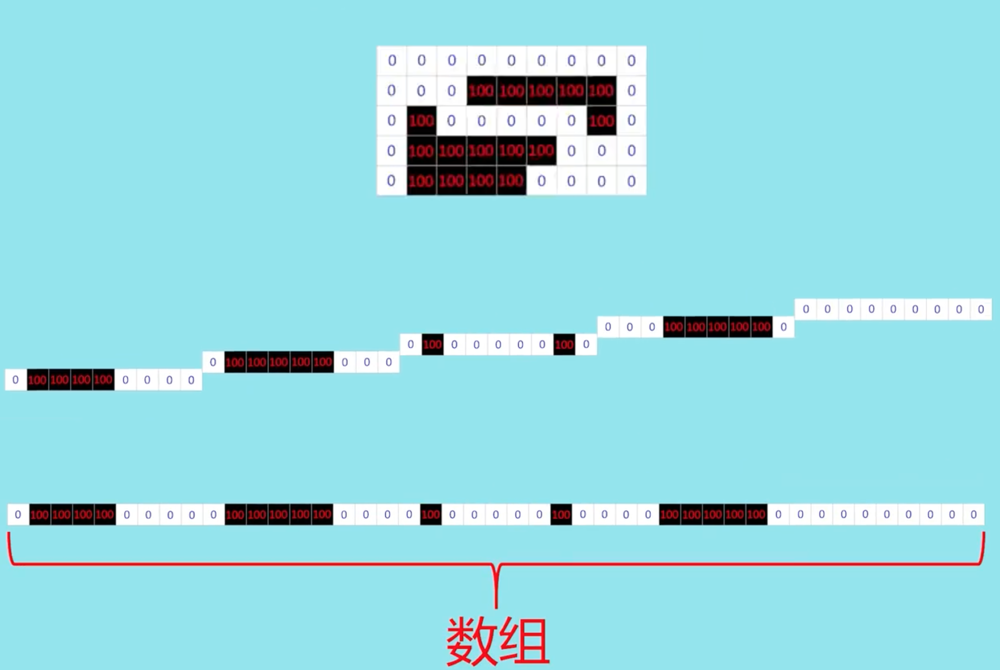

在实际应用中，ROS中的栅格地图是经过SLAM算法之后得到的结果。

视频地址：[https://www.bilibili.com/video/BV1uD4y1z74h](https://www.bilibili.com/video/BV1uD4y1z74h/)

## 三十九、ROS中，使用C++发布自定义地图

**实现步骤**

- 构建一个软件包`map_pkg`，依赖项里加上`nav_msgs`
- 在`map_pkg`里创建一个节点`map_pub_node`
- 在节点中发布话题`/map`，消息类型为`nav_msgs::OccupancyGrid`
- 构建一个`nav_msgs::OccupancyGrid`地图消息包，并对其进行赋值将地图消息包发送到话题`/map`
- 编译并运行节点
- 启动`RViz`，订阅话题`/map`，显示地图

**发布自定义地图节点示例代码**

示例代码也可以在`wpr_simulation/src/demo_map_pub.cpp`中找到：

```C++
# include <iostream>
# include <ros/ros.h>
# include <nav_msgs/OccupancyGrid.h>

int main(int argc, char** argv)
{
    ros::init(argc, argv, "map_pub_node");

    ros::NodeHandle n;
    ros::Publisher pub = n.advertise<nav_msgs::OccupancyGrid>("/map", 10);

    ros::Rate r(1);
    while (ros::ok())
    {
        nav_msgs::OccupancyGrid msg;
        // header
        msg.header.frame_id = "map";
        msg.header.stamp = ros::Time::now();
        // 地图描述信息
        msg.info.origin.position.x = 0;
        msg.info.origin.position.y = 0;
        msg.info.resolution = 1.0;
        msg.info.width = 4;
        msg.info.height = 2;
        // 地图数据
        msg.data.resize(4*2);
        msg.data[0] = 100;
        msg.data[1] = 100;
        msg.data[2] = 0;
        msg.data[3] = -1;
        // 发送
        pub.publish(msg);
        r.sleep();
    }
    return 0;
}
```

**在RViz中显示栅格地图**

- 启动`RViz`，命令行中输入`rviz`
- 在`RViz`中添加一个坐标系`Axes`
- 在`RViz`中添加一个地图`Map`，并订阅话题`/map`

完成以上步骤，即可显示地图，如下图所示

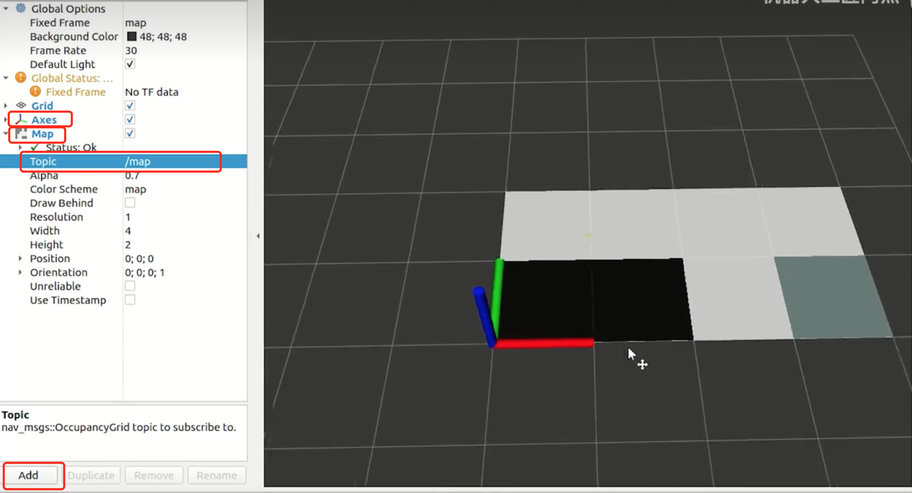

视频地址：[https://www.bilibili.com/video/BV1yG411G7ht](https://www.bilibili.com/video/BV1yG411G7ht)

## 四十、ROS中，使用Python发布自定义地图

**实现步骤**

- 构建一个软件包`map_pkg`，依赖项里加上`nav_msgs`
- 编译软件包，让其进入ROS的包列表
- 在`map_pkg`里创建一个节点`map_pub_node.py`在节点中发布话题`/map`，消息类型为`OccupancyGrid`
- 构建一个`OccupancyGrid`地图消息包，并对其进行赋值将地图消息包发送到话题`/map`
- 为节点`map_pub node.py`添加可执行权限
- 运行`map_pub node.py`节点
- 启动`RViz`，订阅话题`/map`，显示地图

**发布自定义地图节点示例代码**

示例代码也可以在`wpr_simulation/scripts/demo_map_pub.py`中找到：

```Python
#!/usr/bin/env python3
# coding=utf-8

import rospy
from nav_msgs.msg import OccupancyGrid

if __name__ == "__main__":
    rospy.init_node("demo_map_pub")
    # 发布地图话题
    pub = rospy.Publisher("/map",OccupancyGrid,queue_size=10)
    # 构建发送频率对象
    rate = rospy.Rate(1)
    while not rospy.is_shutdown():
        # 构建地图消息包并赋值
        msg = OccupancyGrid()
        # header
        msg.header.frame_id = "map"
        msg.header.stamp = rospy.Time.now()
        # 地图描述信息
        msg.info.origin.position.x = 0
        msg.info.origin.position.y = 0
        msg.info.resolution = 1.0
        msg.info.width = 4
        msg.info.height = 2
        # 地图数据
        msg.data = [0]*4*2
        msg.data[0] = 100
        msg.data[1] = 100
        msg.data[2] = 0
        msg.data[3] = -1
        pub.publish(msg)
        rate.sleep()
```

视频地址：[https://www.bilibili.com/video/BV1hd4y1X75p](https://www.bilibili.com/video/BV1hd4y1X75p)

## 四十一、SLAM的基本概念和原理

SLAM, Simultaneous Localization And Mapping, 同时定位与地图构建，主要包括两个内容，定位与构图

根据同一参照物的在不同观测点的视图中的位置，可以推断出观测点之间的相对位移（定位），还能得到新的参照物的在地图中的位置（构图），相当于对前一个局部地图进行了范围扩展

在视觉SLAM中，参照物是特征点，而在实际应用中，参照物可以是二维码、颜色标记、电子标签

- 定位：确定机器人在地图（世界坐标系）的位置
- 构图：确定参照物在地图中的位置

仅记录参照物的地图为特征地图，根据特征地图就可以完成导航任务

博主讲的简单易懂，不仅有现实生活中的案例，还有激光雷达SLAM构建地图的动画与讲解，视频地址：[https://www.bilibili.com/video/BV1FW4y1M7PV](https://www.bilibili.com/video/BV1FW4y1M7PV)

## 四十二、在ROS中，使用Hector Mapping软件包实现SLAM建图功能

使用`Hector Mapping`软件包实现SLAM建图的步骤，如下图所示：

不难发现的是`Hector Mapping`算法仅使用了激光雷达数据，并且该算法没有使用里程计（什么是里程计将在 [第四十六节-里程计在激光雷达 SLAM 中的作用](#四十六里程计在激光雷达-slam-中的作用) 中讲到）。

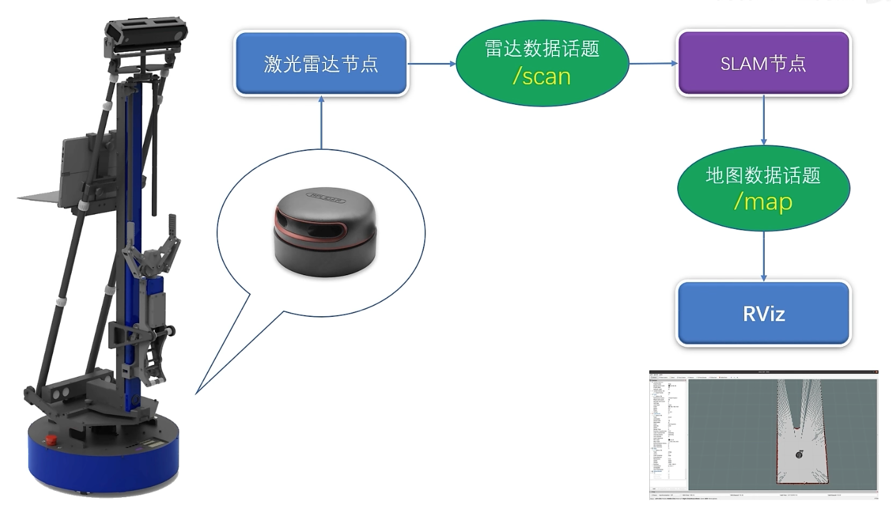

**Hector Mapping API文档**

在[index.ros.org](https://index.ros.rog)中搜索`hector_mapping`，可以查看相应ROS版本的文档，文档中描述了以下信息，这里不详细描述了，想进一步了解直接看文档吧：

- 订阅与发布的话题以及相关消息数据包
- 服务以及节点的参数
- 需要提供的坐标变换以及算法输出的坐标变换信息

**服务Service与话题Topic的不同**

以上提到了服务Service，这里的服务也是一种通信机制，与发布/订阅话题的的不同是：

- 订阅/发布话题是不同步的，发布者只管发布消息，不管有没有或有几个订阅者，也不管订阅者能不能跟得上自己的发布速度。订阅者则只管监听消息，不会告诉发布者听没听到。这种方式交换数据的效率高，但完全不具备应答功能
- 服务是双向同步的信息传输，是具备应答功能的，当服务端收到服务请求后，会对请求做出响应，将数据的处理结果返回给客户端，服务调用非常适合那些只需要偶尔去做，并且会在有限的时间里完成的事

参考博客链接：[服务 Service 详解](https://blog.csdn.net/zxxxiazai/article/details/108322219)

**实现SLAM建图功能**

- 使用`sudo apt install`安装`Hector Mapping`包
- 运行ROS机器人核心和仿真环境
- 运行`Hector Mapping`节点
- 运行`RViz`可视化建图结果
  - 添加机器人模型`RobotModel`
  - 添加激光雷达`LaserScan`，订阅`/Scan`话题
  - 添加地图`Map`，订阅`/Map`话题
- 运行`rqt_robot_steering`速度控制工具，控制机器人把整个地图扫描完，实现SLAM建图

视频地址：[https://www.bilibili.com/video/BV13g4y157R9](https://www.bilibili.com/video/BV13g4y157R9)

## 四十三、在ROS中，编写launch文件启动Hector Mapping

在实现SLAM建图功能时，需要启动多个节点以及launch文件，这里编写launch文件启动，更加方便一些。

这里引用其他的launch文件，是通过`include`标签中的`file`属性进行引用，这里的`file`是要引用的launch文件的具体路径，这里也可以通过`rospack`指令来获取软件包的完整路径，语法为`$(find 软件包名称)`。

另外，在启动`RViz`做可视化时，需要添加机器人模型`RobotModel`、激光雷达`LaserScan`等才能现实SLAM建图结果，因此这里将`RViz`的配置先保存下来，后面直接加载配置更加方便，命令`rosrun rviz rviz -d 配置文件路径`是加载`rviz`配置文件，这里对应到launch文件的设置是在`node`标签中加入一个`args`属性，属性值为`"-d 配置文件路径"`

整个launch文件内容如下，也可以打开`wpr_simulation/launch/wpb_hector.launch`文件查看。

```xml
<launch>

  <!-- 载入 机器人 和 SLAM 的仿真场景 -->
  <include file="$(find wpr_simulation)/launch/wpb_stage_slam.launch"/>

  <!-- Hector SLAM -->
  <node pkg="hector_mapping" type="hector_mapping" name="hector_mapping" />

  <!-- Rviz 显示 -->
  <node pkg="rviz" type="rviz" name="rviz" args="-d $(find wpr_simulation)/rviz/slam.rviz"/>

  <!-- 运动控制 -->
  <node pkg="rqt_robot_steering" type="rqt_robot_steering" name="rqt_robot_steering"/>

</launch>
```

视频地址：[https://www.bilibili.com/video/BV1aV4y1C7wG](https://www.bilibili.com/video/BV1aV4y1C7wG)

## 四十四、在launch文件中，为Hector Mapping设置建图参数

在 [第四十二小节 - 在ROS中，使用Hector Mapping软件包实现SLAM建图功能](#四十二在ros中使用hector-mapping软件包实现slam建图功能) 中有说到，Hector Mapping节点提供了很多参数，不进行设置就会使用默认值，通过在`node`标签中添加`param`子标签可以实现参数设置，语法如下`<param name="参数名" value="参数值"/>`，如下方launch文件所示。
```xml
<launch>

  <!-- 载入 机器人 和 SLAM 的仿真场景 -->
  <include file="$(find wpr_simulation)/launch/wpb_stage_slam.launch"/>

  <!-- Hector SLAM -->
  <node pkg="hector_mapping" type="hector_mapping" name="hector_mapping" >
      <!-- 地图更新的距离阈值，距离变化大于这个值，更新地图 -->
      <param name="map_update_distance_thresh" value="0.4"/>
      <!-- 地图更新的角度阈值，角度变化大于这个值，更新地图 -->
      <param name="map_update_angle_thresh" value="0.9" />
      <!-- 地图发布的时间间隔 -->
      <param name="map_pub_period" value="0.2" /> 
  </node>

  <!-- Rviz 显示 -->
  <node pkg="rviz" type="rviz" name="rviz" args="-d $(find wpr_simulation)/rviz/slam.rviz"/>

  <!-- 运动控制 -->
  <node pkg="rqt_robot_steering" type="rqt_robot_steering" name="rqt_robot_steering"/>

</launch>
```

**使用node标签中args属性与node子标签param设置参数的区别**

- `args`属性一般是用于设置命令行启动节点参数
- `param`标签一般是用于设置参数服务器parameter server中存储的参数

参考博客链接：

- [launch文件中param、rosparam以及arg之间的区别](https://blog.csdn.net/weixin_45777375/article/details/109445591)
- [ROS向节点传递参数的方法总结](https://blog.csdn.net/u013834525/article/details/88744327)
- [rosparam param env arg 的用法](https://www.cnblogs.com/marty86/p/7818658.html)

**使用launch文件启动两个机器人查看设置不同参数值的区别**

有时候，当仅有一个机器人时，设置不同的参数并不能很明显的看出差别来，为了更好的查看参数修改前后的变化，我们可以让两台机器人在同一场景中运行，分别进行SLAM建图，两者一对比就能看出差别来。

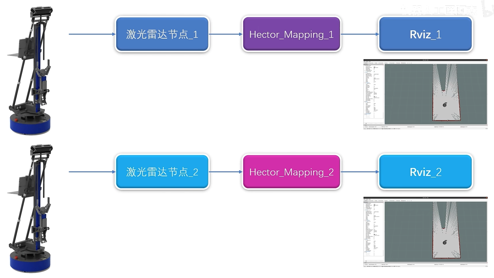

运行两个机器人的launch文件内容如下，也可以打开`wpr_simulation/launch/wpb_hector_comparison.launch`文件查看。

- 创建了两个设置了不同参数的Hector_Mapping建图节点
- 载入 SLAM 的仿真场景，并在场景中加入了两个并排的机器人（y轴作为分布为-0.3和0.3）
- 运行运动控制节点`rqt_robot_steering`，并将速度控制数据分发给两个机器人（话题分流）

```xml
<launch>

  <!-- 第一个 Hector_Mapping 建图节点 -->
  <group ns="slam_1">
    <node pkg="hector_mapping" type="hector_mapping" name="hector_mapping_1">

      <param name="map_update_distance_thresh" value="0.4"/>
      <param name="map_update_angle_thresh" value="0.9" />
      <param name="map_pub_period" value="0.2" />
      
      <param name="map_frame" value="slam_1/map" />
      <param name="base_frame" value="slam_1/base_footprint" />
      <param name="odom_frame" value="slam_1/odom" />
    </node>
  </group>

  <!-- 第二个 Hector_Mapping 建图节点 -->
  <group ns="slam_2">
    <node pkg="hector_mapping" type="hector_mapping" name="hector_mapping_2">

      <param name="map_update_distance_thresh" value="0.1"/>
      <param name="map_update_angle_thresh" value="0.1" />
      <param name="map_pub_period" value="0.2" />

      <param name="map_frame" value="slam_2/map" />
      <param name="base_frame" value="slam_2/base_footprint" />
      <param name="odom_frame" value="slam_2/odom" />
    </node>
  </group>

  <!-- **************************** 分割线 **************************** -->

  <!-- 载入 SLAM 的仿真场景 -->
  <include file="$(find gazebo_ros)/launch/empty_world.launch">
  <arg name="world_name" value="$(find wpr_simulation)/worlds/slam_simple.world"/>
  <arg name="paused" value="false"/>
  <arg name="use_sim_time" value="true"/>
  <arg name="gui" value="true"/>
  <arg name="recording" value="false"/>
  <arg name="debug" value="false"/>
  </include>

  <!-- 载入 1号机器人 -->
  <include file="$(find wpr_simulation)/launch/wpb_slam_template.launch">
      <arg name="robot_namespace" value="slam_1" /> 
      <arg name="local_x" value="0" /> 
      <arg name="local_y" value="-0.3" /> 
      <arg name="local_yaw" value="0" /> 
  </include>

  <!-- 载入 2号机器人 -->
  <include file="$(find wpr_simulation)/launch/wpb_slam_template.launch">
      <arg name="robot_namespace" value="slam_2" /> 
      <arg name="local_x" value="0" /> 
      <arg name="local_y" value="0.3" /> 
      <arg name="local_yaw" value="0" /> 
  </include>

  <!-- 运动控制 -->
  <node pkg="rqt_robot_steering" type="rqt_robot_steering" name="rqt_robot_steering"/>

  <!-- 速度话题分流 -->
  <node pkg = "topic_tools" type = "relay" name = "relay_1" args="/cmd_vel /slam_1/cmd_vel" />
  <node pkg = "topic_tools" type = "relay" name = "relay_2" args="/cmd_vel /slam_2/cmd_vel" />

</launch>
```

**两个机器人分布设置不同参数值的效果的区别**

设置的距离与角度更新阈值更小的机器人，地图更新更快，如下图所示。

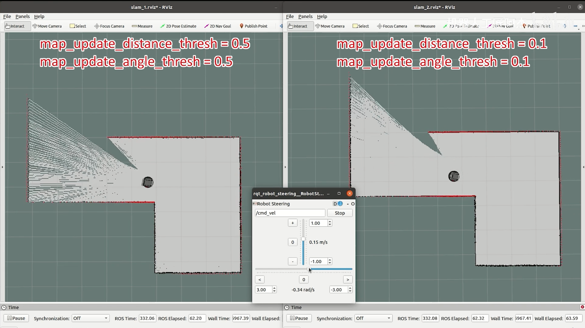

视频地址：[https://www.bilibili.com/video/BV1dT4114741](https://www.bilibili.com/video/BV1dT4114741)

## 四十五、初识ROS的TF系统

TF是TransForm的缩写，指的是坐标变换，如下图所示，世界坐标系(map，一般是机器人运动的起点)与机器人(base_footprint，一般是机器人底盘中心)坐标系之间就存在一种变换关系：

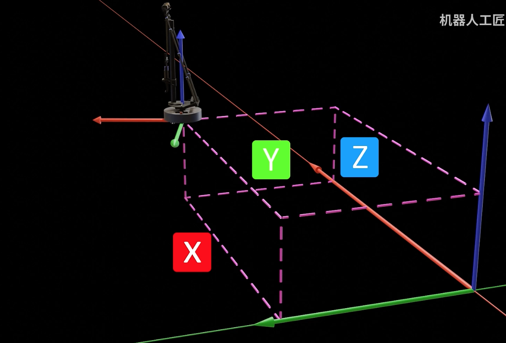

**ROS的TF系统**

在ROS中，TF发布节点，发布TF关系到`/tf`话题中，TF订阅节点就可以通过订阅`/tf`话题查询知道有那些坐标系以及坐标系之间的空间关系，例如`RViz`能够现实地图与机器人的相对位置，就是`RViz`订阅了`/tf`话题，在`RViz`中甚至可以显示各个TF坐标系。

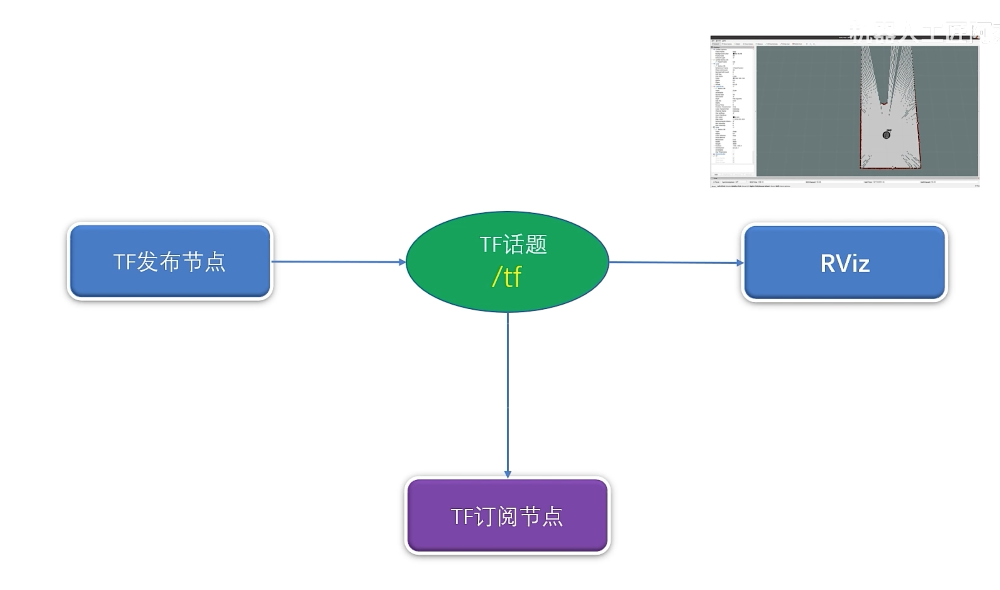

**RViz中显示TF坐标系**

在`RViz`中添加TF坐标系，并在Frames可以看到当前存在的所有坐标系。

)

**TF消息包类型**

通过命令`rostopic type 话题名称`可查看话题消息包类型，`/tf`话题的消息格式是`tf2_msgs/TFMessage`，通过[index.ros.org](https://index.ros.org)查找`tf2_msgs`包中的`TFMessage`，发现消息包数据类型是`geometry_msgs/TransformStamped[] transforms`，

- `geometry_msgs/TransformStamped`，TFMessage中的数据类型
  - `std_msgs/Header header`，消息头，包括时间戳以及父坐标系的名称等
  - `string child_frame_id`，子坐标系的名称
  - `geometry_msgs/Transform transform`，子坐标系相对于父坐标系的变换关系
    - `geometry_msgs/Vector3 translation`，子坐标系在父坐标系中xyz的偏移量
    - `geometry_msgs/Quaternion rotation`，子坐标系在父坐标系中角度偏差量（四元数格式）

**通过运行`rqt_tf_tree`节点可查看坐标系之间的父子关系**

运行命令`rosrun rqt_tf_tree rqt_tf_tree`


视频地址：[https://www.bilibili.com/video/BV1uh4y1377t](https://www.bilibili.com/video/BV1uh4y1377t)

## 四十六、里程计在激光雷达 SLAM 中的作用

之前提到`Hector Mapping`算法中没有使用里程计(odometry)，只使用雷达点云和障碍物配准的方法来进行定位，这导致进入到一个特征相似的场景之后，会使得算法认为机器人没有移动了，例如，在长直的走廊，每次得到的激光雷达数据都是左右的两面墙，这个时候就需要加上里程计，让算法知道机器人还在走以及走过的距离。

里程计(odometry)在驱动节点中实现，发送到`/tf`话题中（在`tf_tree`中的`odom`坐标系）


里程计输出的位置信息，通过电机转速计算而来，只是一个理论值，在实际机器人运动中，可能存在机器人轮子打滑的情况，而这种情况就和实际的情况会存在一些偏差，而且随着运动的进行，误差会不断累加，这样就需要修正一下它（例如通过激光雷达点云的匹配修正位置，如下图所示），修正里程计误差的算法就是`Gmapping`的核心算法。

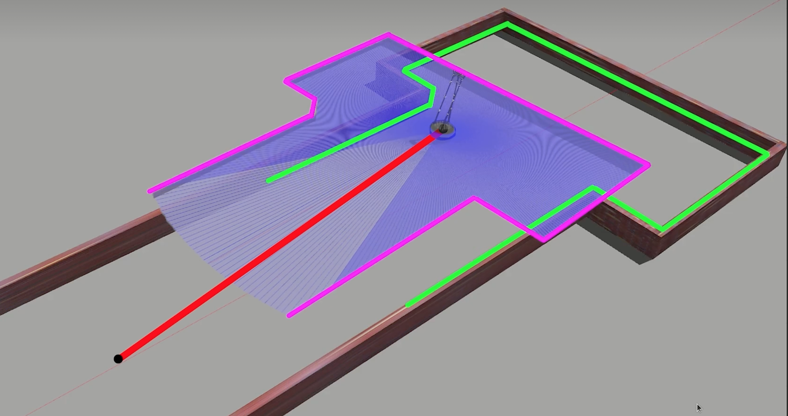


在里程计的帮助下，激光雷达SLAM可以有效的克服了建图过程中位移特征缺失的问题。在实际的应用中，里程计的形式可能多种多样，甚至连SLAM输出的定位信息，都可能作为另外一个SLAM系统所需要的里程计，但是无论是什么样的形式，里程计的思想，归根结底，就是利用不同形式的定位方法去克服某种单一SLAM算法的缺陷，减少误差或者增加稳定性。

视频地址：[https://www.bilibili.com/video/BV1ih4y177QK](https://www.bilibili.com/video/BV1ih4y177QK)

## 四十七、在仿真环境中使用Gmapping进行SLAM建图

在[index.ros.org](https://index.ros.rog)中搜索`gmapping`，可以查看相应ROS版本的文档，通过文档知道，我们需要订阅`/tf`话题以及`/scan`话题，即需要提供 激光雷达数据 以及 激光雷达坐标系到底盘坐标系`base_link`的变换和底盘坐标系`base_link`到`odom`坐标系的变换（即里程计输出的TF变换）。

这里雷达坐标系的名称可以查看`/scan`话题中雷达数据包中的frame_id。

确认了输入之后，就可以运行Gmapping节点输出建图了。`rosrun gmapping slam_gmapping`

视频地址：[https://www.bilibili.com/video/BV1LV411T7Pm](https://www.bilibili.com/video/BV1LV411T7Pm)

## 四十八、在ROS中，通过launch文件启动Gmapping进行SLAM建图

使用launch文件启动多个节点，前面已经做过多次，这里不再赘述了。可以看视频或者是[第四十三小节-在ROS中，编写launch文件启动Hector Mapping](#四十三在ros中编写launch文件启动hector-mapping)。
下面直接贴出，launch文件的内容，可直接查看`wpr_simulation/launch/wpb_corridor_gmapping.launch`文件内容。

```xml
<launch>

  <!-- 载入 机器人 和 长走廊 的仿真场景 -->
  <include file="$(find wpr_simulation)/launch/wpb_stage_corridor.launch"/>

  <!-- Gmapping -->
  <node pkg="gmapping" type="slam_gmapping" name="slam_gmapping"/>

  <!-- Rviz -->
  <arg name="rvizconfig" default="$(find wpr_simulation)/rviz/corridor.rviz" />
  <node name="rviz" pkg="rviz" type="rviz" args="-d $(arg rvizconfig)" required="true" />

  <!-- 运动控制 -->
  <node pkg="rqt_robot_steering" type="rqt_robot_steering" name="rqt_robot_steering"/>

</launch>
```

视频地址：[https://www.bilibili.com/video/BV1wF411Q7Q3](https://www.bilibili.com/video/BV1wF411Q7Q3)

## 四十九、Gmapping建图的参数设置

`gmapping`的参数大致分为三类：

- **接口相关参数**，跟仿真或者是实体机器人对接的一些参数，例如底盘坐标系的名称、地图坐标系名称、里程计坐标系名称等。
- **性能相关参数**，涉及到对CPU和内存的消耗
- **算法相关参数**，对算法本身进行调优的参数

一般调整前两种参数（接口相关参数 和 性能相关参数），使用默认的算法相关参数，即可适用于大多数的环境情况。如果需要调整算法相关参数，则需要对算法有比较深入的了解。

性能相关参数可能包括以下内容，具体说明可以查看视频或者文档：

- 地图尺寸
  - 地图的大小，地图越大，占用的内存越多
  - 地图分辨率，地图分辨率越小，占用内存越多
  - ……
- 激光雷达
  - 最大有效距离
  - 最大采纳距离
  - 跳线距离
  - 数据跳帧处理
  - ……
- 地图更新
  - 更新时间间隔
  - 移动距离阈值
  - 旋转角度距离阈值
  - ……
- 定义相关
- ……

launch文件的编写，这里不再赘述了，可以看视频或者是[第四十四小节-在launch文件中，为Hector Mapping设置建图参数](#四十四在launch文件中为hector-mapping设置建图参数)。

视频地址：[https://www.bilibili.com/video/BV1Kc411F7se](https://www.bilibili.com/video/BV1Kc411F7se)
